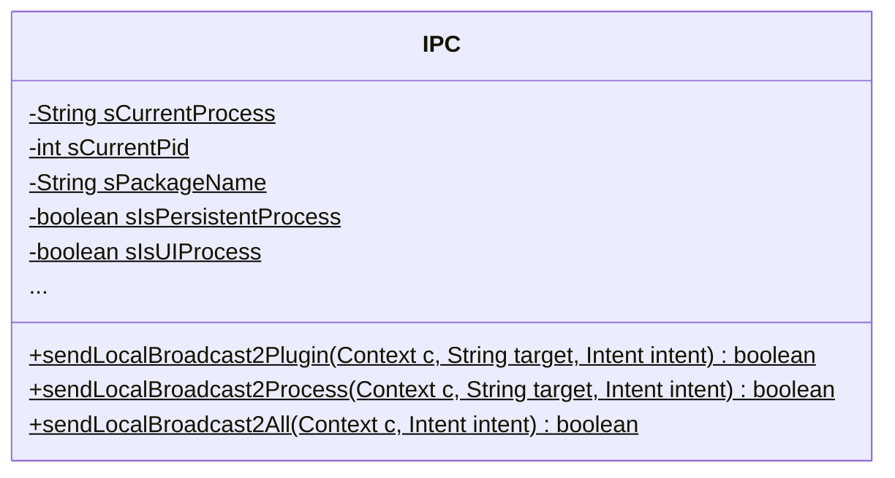
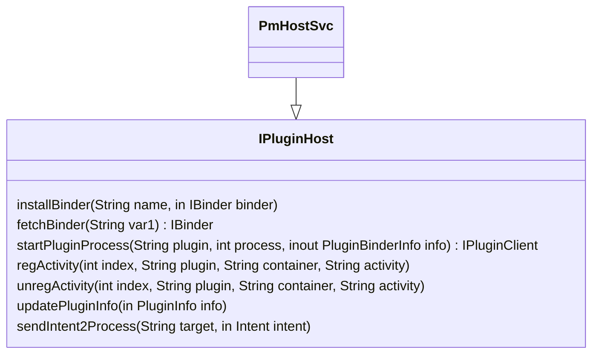

# 360 Replugin 插件学习

[toc]
* [一、简单使用](#一简单使用)
  * [1.1 宿主集成](#11-宿主集成)
  * [1.2 插件开发](#12-插件开发)
  * [1.3 主要场景应用](#13-主要场景应用)
* [二、原理](#二原理)
  * [2.1 工程结构](#21-工程结构)
     * [2.1.1 插件的gradle插件——replugin-plugin-gradle](#211-插件的gradle插件replugin-plugin-gradle)
     * [2.1.2 <span id="user-content-replugin-plugin-lib">插件库——replugin-plugin-lib</span>](#212-插件库replugin-plugin-lib)
     * [<span id="user-content-replugin-host-gradle">2.1.3 宿主 gradle 插件——replugin-host-gradle</span>](#213-宿主-gradle-插件replugin-host-gradle)
     * [2.1.4 宿主库——replugin-host-lib](#214-宿主库replugin-host-lib)
  * [2.2 Classloader Hook](#22-classloader-hook)
  * [2.3 插件安装](#23-插件安装)
  * [<span id="user-content-plugin-loaded">2.4 插件加载</span>](#24-插件加载)
  * [2.5 Activity启动](#25-activity启动)
  * [2.6 资源加载](#26-资源加载)
  * [<span id="user-content-process-manager">2.7 进程管理</span>](#27-进程管理)
     * [2.7.1 进程启动初始化](#271-进程启动初始化)
     * [2.7.2 进程启动时间](#272-进程启动时间)
     * [2.7.3 进程通信](#273-进程通信)
* [三、总结](#三总结)
* [参考文档](#参考文档)
## 一、简单使用
[Replugin]文档中详细说明了如何集成Replugin，以及如何实现插件和宿主各个场景下界面切换，功能交互。此处不会进行详细介绍，只是列举几个示例，方便有对RePlugin有个直观认识，具体参考相关文档。

### 1.1 宿主集成
* 集成`replugin-host-gradle`插件、`replugin-host-lib`库，个性化配置
 ```Gradle
 android {
    // ATTENTION!!! Must CONFIG this to accord with Gradle's standard, and avoid some error
    defaultConfig {
        applicationId "com.qihoo360.replugin.sample.host"
        ...
    }
    ...
}

// ATTENTION!!! Must be PLACED AFTER "android{}" to read the applicationId
apply plugin: 'replugin-host-gradle'

/**
 * 配置项均为可选配置，默认无需添加
 * 更多可选配置项参见replugin-host-gradle的RepluginConfig类
 * 可更改配置项参见 自动生成RePluginHostConfig.java
 */
repluginHostConfig {
    /**
     * 是否使用 AppCompat 库
     * 不需要个性化配置时，无需添加
     */
    useAppCompat = true
    /**
     * 背景不透明的坑的数量
     * 不需要个性化配置时，无需添加
     */
    countNotTranslucentStandard = 6
    countNotTranslucentSingleTop = 2
    countNotTranslucentSingleTask = 3
    countNotTranslucentSingleInstance = 2
}

dependencies {
    compile 'com.qihoo360.replugin:replugin-host-lib:2.2.4'
    ...
}
```
* 配置Application类，初始化插件
```java
public class MainApplication extends Application {

    @Override
    protected void attachBaseContext(Context base) {
        super.attachBaseContext(base);

        RePlugin.App.attachBaseContext(this);
        ....
    }

    @Override
    public void onCreate() {
        super.onCreate();

        RePlugin.App.onCreate();
        ....
    }
    ....
  }
```

### 1.2 插件开发
* 应用`replugin-plugin-gradle`插件，并添加 `replugin-plugin-lib` 依赖
```gradle
apply plugin: 'replugin-plugin-gradle'

dependencies {
    compile 'com.qihoo360.replugin:replugin-plugin-lib:2.2.4'
    ...
}
```

### 1.3 主要场景应用
* 安装和升级插件，预加载、卸载插件
```java
// 安装和升级插件
RePlugin.install("/sdcard/exam.apk");
// 预加载
if (pi != null) {
	RePlugin.preload(pi);
}
// 卸载
RePlugin.uninstall("exam");
```
* Activity启动
```java
// 插件内部组件打开
Intent intent = new Intent(v.getContext(), ThemeDialogActivity.class);
context.startActivity(intent);

//打开插件外组件
Intent intent = new Intent();
intent.setComponent(new ComponentName("demo2",
    "com.qihoo360.replugin.sample.demo2.databinding.DataBindingActivity"));
context.startActivity(intent);

// 打开宿主组件
Intent intent = new Intent();
intent.setComponent(new ComponentName("com.qihoo360.replugin.sample.host", "com.qihoo360.replugin.sample.host.MainActivity"));
context.startActivity(intent);

// 主程序打开插件组件
RePlugin.startActivity(MainActivity.this, RePlugin.createIntent("demo1",
    "com.qihoo360.replugin.sample.demo1.MainActivity"));
```

## 二、原理
从上述应用中，整个Replugin框架实现由四部分组成：`replugin-host-gradle`、`replugin-host-lib`、`replugin-plugin-gradle`、`replugin-plugin-lib`。整体架构根据[RePlugin]文档，结构如下：

Replugin通过hook Android系统的ClassLoader，实现插件能够在应用中加载使用。
其主要设计思想：
1. hook 系统的ClassLoader
2. 当需要打开插件的Activity时，建立坑位ActivityNS和目标的Activity映射关系，打开坑位ActivityNS
3. 当classloader加载ActivityNS的时候，替换成目标的Activity。

### 2.1 工程结构
#### 2.1.1 插件的gradle插件——replugin-plugin-gradle
插件的gradle插件主要作用是为了调试、自动替换一些系统类及方法，以便插件能够Replugin中正常使用。
**1.创建Gradle task**
```groovy
/** 用户Task:强制停止宿主app */
   def static final TASK_FORCE_STOP_HOST_APP = TASKS_PREFIX + "ForceStopHostApp"

   /** 用户Task:启动宿主app */
   def static final TASK_START_HOST_APP = TASKS_PREFIX + "StartHostApp"

   /** 用户Task:重启宿主app */
   def static final TASK_RESTART_HOST_APP = TASKS_PREFIX + "RestartHostApp"


   /** 用户Task:安装插件 */
   def static final TASK_INSTALL_PLUGIN = TASKS_PREFIX + "InstallPlugin"

   /** 用户Task:安装插件 */
   def static final TASK_UNINSTALL_PLUGIN = TASKS_PREFIX + "UninstallPlugin"

   /** 用户Task:运行插件 */
   def static final TASK_RUN_PLUGIN = TASKS_PREFIX + "RunPlugin"

   /** 用户Task:安装并运行插件 */
   def static final TASK_INSTALL_AND_RUN_PLUGIN = TASKS_PREFIX + "InstallAndRunPlugin"
```

插件定义上述命名的task，主要用于插件的安装、卸载和更新。以安装插件task为例：

```groovy
def installPluginTaskName = scope.getTaskName(AppConstant.TASK_INSTALL_PLUGIN, "")
def installPluginTask = project.task(installPluginTaskName)

installPluginTask.doLast {
    pluginDebugger.startHostApp()
    pluginDebugger.uninstall()
    pluginDebugger.forceStopHostApp()
    pluginDebugger.startHostApp()
    pluginDebugger.install()
}

  /**
    * 启动宿主app
    * @return 是否命令执行成功
    */
   public boolean startHostApp() {

       if (isConfigNull()) {
           return false
       }

       String cmd = "${adbFile.absolutePath} shell am start -n \"${config.hostApplicationId}/${config.hostAppLauncherActivity}\" -a android.intent.action.MAIN -c android.intent.category.LAUNCHER"
       if (0 != CmdUtil.syncExecute(cmd)) {
           return false
       }
       return true
   }

   /**
    * 安装插件
    * @return 是否命令执行成功
    */
   public boolean install() {

       if (isConfigNull()) {
           return false
       }

       //推送apk文件到手机
       String pushCmd = "${adbFile.absolutePath} push ${apkFile.absolutePath} ${config.phoneStorageDir}"
       if (0 != CmdUtil.syncExecute(pushCmd)) {
           return false
       }

       //此处是在安卓机上的目录，直接"/"路径
       String apkPath = "${config.phoneStorageDir}"
       if (!apkPath.endsWith("/")) {
           //容错处理
           apkPath += "/"
       }
       apkPath += "${apkFile.name}"

       //发送安装广播
       String installBrCmd = "${adbFile.absolutePath} shell am broadcast -a ${config.hostApplicationId}.replugin.install -e path ${apkPath} -e immediately true "
       if (0 != CmdUtil.syncExecute(installBrCmd)) {
           return false
       }

       return true
   }
```
从上述代码中可以看出，`InstallPlugin` task主要通过启动宿主APP、安装插件等步骤完成，具体实现通过adb命令完成相关交互。

**2.替换系统类和方法**
通过[javassist]对编译后的系统组件或者方法进行替换，主要实现在如下几个类中：

其中以资源获取方法和Activity组件替换为例：
```groovy
public class GetIdentifierExprEditor extends ExprEditor {

    public def filePath

    @Override
    void edit(MethodCall m) throws CannotCompileException {
        String clsName = m.getClassName()
        String methodName = m.getMethodName()

        if (clsName.equalsIgnoreCase('android.content.res.Resources')) {
            if (methodName == 'getIdentifier') {
                m.replace('{ $3 = \"' + CommonData.appPackage + '\"; ' +
                        '$_ = $proceed($$);' +
                        ' }')
                println " GetIdentifierCall => ${filePath} ${methodName}():${m.lineNumber}"
            }
        }
    }
}
```
`Resources.getIdentifier`方法如下：
```java
/**
    * Return a resource identifier for the given resource name.  A fully
    * qualified resource name is of the form "package:type/entry".  The first
    * two components (package and type) are optional if defType and
    * defPackage, respectively, are specified here.
    *
    * <p>Note: use of this function is discouraged.  It is much more
    * efficient to retrieve resources by identifier than by name.
    *
    * @param name The name of the desired resource.
    * @param defType Optional default resource type to find, if "type/" is
    *                not included in the name.  Can be null to require an
    *                explicit type.
    * @param defPackage Optional default package to find, if "package:" is
    *                   not included in the name.  Can be null to require an
    *                   explicit package.
    *
    * @return int The associated resource identifier.  Returns 0 if no such
    *         resource was found.  (0 is not a valid resource ID.)
    */
   public int getIdentifier(String name, String defType, String defPackage) {
       return mResourcesImpl.getIdentifier(name, defType, defPackage);
   }
```
因此当插件中调用`Resources.getIdentifier`方法时，会将`defPackage`改成插件的包名。

而Activity组件替换主要实现如下：
```groovy
public class LoaderActivityInjector extends BaseInjector {

    def private static LOADER_PROP_FILE = 'loader_activities.properties'

    /* LoaderActivity 替换规则 */
    def private static loaderActivityRules = [
            'android.app.Activity'                    : 'com.qihoo360.replugin.loader.a.PluginActivity',
            'android.app.TabActivity'                 : 'com.qihoo360.replugin.loader.a.PluginTabActivity',
            'android.app.ListActivity'                : 'com.qihoo360.replugin.loader.a.PluginListActivity',
            'android.app.ActivityGroup'               : 'com.qihoo360.replugin.loader.a.PluginActivityGroup',
            'android.support.v4.app.FragmentActivity' : 'com.qihoo360.replugin.loader.a.PluginFragmentActivity',
            'android.support.v7.app.AppCompatActivity': 'com.qihoo360.replugin.loader.a.PluginAppCompatActivity',
            'android.preference.PreferenceActivity'   : 'com.qihoo360.replugin.loader.a.PluginPreferenceActivity',
            'android.app.ExpandableListActivity'      : 'com.qihoo360.replugin.loader.a.PluginExpandableListActivity'
    ]
    ...
    /**
     * 处理 Activity
     *
     * @param pool
     * @param activity Activity 名称
     * @param classesDir class 文件目录
     */
    private def handleActivity(ClassPool pool, String activity, String classesDir) {
      ...
      def stream, ctCls
        try {
            stream = new FileInputStream(clsFilePath)
            ctCls = pool.makeClass(stream);

            // ctCls 之前的父类
            def originSuperCls = ctCls.superclass

            /* 从当前 Activity 往上回溯，直到找到需要替换的 Activity */
            def superCls = originSuperCls
            while (superCls != null && !(superCls.name in loaderActivityRules.keySet())) {
                // println ">>> 向上查找 $superCls.name"
                ctCls = superCls
                superCls = ctCls.superclass
            }

            // 如果 ctCls 已经是 LoaderActivity，则不修改
            if (ctCls.name in loaderActivityRules.values()) {
                // println "    跳过 ${ctCls.getName()}"
                return
            }

            /* 找到需要替换的 Activity, 修改 Activity 的父类为 LoaderActivity */
            if (superCls != null) {
                def targetSuperClsName = loaderActivityRules.get(superCls.name)
                // println "    ${ctCls.getName()} 的父类 $superCls.name 需要替换为 ${targetSuperClsName}"
                CtClass targetSuperCls = pool.get(targetSuperClsName)

                if (ctCls.isFrozen()) {
                    ctCls.defrost()
                }
                ctCls.setSuperclass(targetSuperCls)

                // 修改声明的父类后，还需要方法中所有的 super 调用。
                ctCls.getDeclaredMethods().each { outerMethod ->
                    outerMethod.instrument(new ExprEditor() {
                        @Override
                        void edit(MethodCall call) throws CannotCompileException {
                            if (call.isSuper()) {
                                if (call.getMethod().getReturnType().getName() == 'void') {
                                    call.replace('{super.' + call.getMethodName() + '($$);}')
                                } else {
                                    call.replace('{$_ = super.' + call.getMethodName() + '($$);}')
                                }
                            }
                        }
                    })
                }

                ctCls.writeFile(CommonData.getClassPath(ctCls.name))
                println "    Replace ${ctCls.name}'s SuperClass ${superCls.name} to ${targetSuperCls.name}"
            }

        } catch (Throwable t) {
            println "    [Warning] --> ${t.toString()}"
        } finally {
            if (ctCls != null) {
                ctCls.detach()
            }
            if (stream != null) {
                stream.close()
            }
        }
      ...
    }
    ....
  }
```
上述逻辑查找类的父类，如果父类是`loaderActivityRules`列举的系统类，则替换成对应的插件库对应的类，并将父类方法调用改成`super`调用。如`MainActivity`继承 `Activity`:

通过插件编译后，变成继承`PluginActivity`:


#### 2.1.2 <span id="replugin-plugin-lib">插件库——replugin-plugin-lib</span>
该库有插件模块依赖，提供了多种宿主和宿主库的反射方法。在上一节提出插件的Gradle插件主要作用除了自定义一些调试task之外，就替换插件的一些系统类或者方法，那么替换的目的是什么呢？
插件加载对插件运行的影响就是初始化插件运行环境，可以让插件功能和与其他插件宿主交互正常进行。其初始化入口：
```Java
public class Entry {

    /**
     * @param context 插件上下文
     * @param cl      HOST程序的类加载器
     * @param manager 插件管理器
     * @return
     */
    public static final IBinder create(Context context, ClassLoader cl, IBinder manager) {
        // 初始化插件框架
        RePluginFramework.init(cl);
        // 初始化Env
        RePluginEnv.init(context, cl, manager);

        return new IPlugin.Stub() {
            @Override
            public IBinder query(String name) throws RemoteException {
                return RePluginServiceManager.getInstance().getService(name);
            }
        };
    }
}
```
其中`RePluginFramework.init(cl)`主要实现如下：
```Java
public class RePluginFramework {

  ....
  private static boolean initLocked(ClassLoader cl) {
        if (mInitialized) {
            return mHostInitialized;
        }
        mInitialized = true;

        try {
            //
            RePluginInternal.ProxyRePluginInternalVar.initLocked(cl);
            RePlugin.ProxyRePluginVar.initLocked(cl);
            PluginLocalBroadcastManager.ProxyLocalBroadcastManagerVar.initLocked(cl);
            PluginProviderClient.ProxyRePluginProviderClientVar.initLocked(cl);
            PluginServiceClient.ProxyRePluginServiceClientVar.initLocked(cl);
            IPC.ProxyIPCVar.initLocked(cl);

            mHostInitialized = true;

        } catch (final Throwable e) {
            if (LogRelease.LOGR) {
                Log.e(TAG, e.getMessage(), e);
            }
        }

        return mHostInitialized;
    }
}
```
这些初始化就是对插件宿主库的一些类进行反射，如以`RePluginInternal`为例：
```Java
static class ProxyRePluginInternalVar {

    private static MethodInvoker createActivityContext;

    private static MethodInvoker handleActivityCreateBefore;

    private static MethodInvoker handleActivityCreate;

    private static MethodInvoker handleActivityDestroy;

    private static MethodInvoker handleRestoreInstanceState;

    private static MethodInvoker startActivity;

    private static MethodInvoker startActivityForResult;

    private static MethodInvoker loadPluginActivity;

    static void initLocked(final ClassLoader classLoader) {

        final String factory2 = "com.qihoo360.i.Factory2";
        final String factory = "com.qihoo360.i.Factory";

        // 初始化Factory2相关方法
        createActivityContext = new MethodInvoker(classLoader, factory2, "createActivityContext", new Class<?>[]{Activity.class, Context.class});
        handleActivityCreateBefore = new MethodInvoker(classLoader, factory2, "handleActivityCreateBefore", new Class<?>[]{Activity.class, Bundle.class});
        handleActivityCreate = new MethodInvoker(classLoader, factory2, "handleActivityCreate", new Class<?>[]{Activity.class, Bundle.class});
        handleActivityDestroy = new MethodInvoker(classLoader, factory2, "handleActivityDestroy", new Class<?>[]{Activity.class});
        handleRestoreInstanceState = new MethodInvoker(classLoader, factory2, "handleRestoreInstanceState", new Class<?>[]{Activity.class, Bundle.class});
        startActivity = new MethodInvoker(classLoader, factory2, "startActivity", new Class<?>[]{Activity.class, Intent.class});
        startActivityForResult = new MethodInvoker(classLoader, factory2, "startActivityForResult", new Class<?>[]{Activity.class, Intent.class, int.class, Bundle.class});

        // 初始化Factory相关方法
        loadPluginActivity = new MethodInvoker(classLoader, factory, "loadPluginActivity", new Class<?>[]{Intent.class, String.class, String.class, int.class});
    }
}
```
其反射`Factory`和`Factory2`的提供的一些方法。类似的，其他初始化分别反射了`RePlugin`、`PluginProviderClient`、`PluginServiceClient`和`IPC`的一些方法，而执行类具体实现都在插件宿主库中实现。
而`RePluginEnv.init`主要是对插件环境相关变量的保存：
```java
/**
 * 插件环境相关变量的封装
 *
 * @author RePlugin Team
 */
public class RePluginEnv {

    private static Context sPluginContext;

    private static Context sHostContext;

    private static ClassLoader sHostClassLoader;

    private static IBinder sPluginManager;

    /**
     * NOTE：如需使用MobileSafeHelper类，请务必先在Entry中调用此方法
     */
    static void init(Context context, ClassLoader cl, IBinder manager) {
        sPluginContext = context;

        // 确保获取的一定是主程序的Context
        sHostContext = ((ContextWrapper) context).getBaseContext();

        sHostClassLoader = cl;

        // 从宿主传过来的，目前恒为null
        sPluginManager = manager;
    }

    /**
     * 获取宿主部分的Context对象
     * 可用来：获取宿主部分的资源、反射类、Info等信息
     * <p>
     * 注意：此Context对象不能用于插件（如资源、类等）的获取。
     * 若需使用插件的Context对象，可直接调用Activity中的getApplicationContext（7.1.0及以后才支持），或直接使用Activity对象即可
     */
    public static Context getHostContext() {
        return sHostContext;
    }

    /**
     * 获取宿主部分的ClassLoader对象
     * 可用来：获取宿主部分的反射类
     * <p>
     * 注意：同HostContext一样，这里的ClassLoader不能加载插件中的class
     */
    public static ClassLoader getHostCLassLoader() {
        return sHostClassLoader;
    }

    /**
     * 获取该插件的PluginContext
     * @return
     */
    public static Context getPluginContext() {
        return sPluginContext;
    }
}
```
从上述初始化，知道了插件的Gradle 插件将一些Android系统类和方法替换成插件库的类及方法，然后间接调用插件宿主库的方法，如:

而`PluginActivity`逻辑如下：
```java
public abstract class PluginActivity extends Activity {

    private PluginResource pluginResource;

    @Override
    protected void attachBaseContext(Context newBase) {
        newBase = RePluginInternal.createActivityContext(this, newBase);
        pluginResource = new PluginResource(newBase);
        super.attachBaseContext(newBase);
    }

    @Override
    public Resources getResources() {
        if (pluginResource != null){
            return pluginResource;
        }
        return super.getResources();
    }

    @Override
    protected void onCreate(Bundle savedInstanceState) {
        //
        RePluginInternal.handleActivityCreateBefore(this, savedInstanceState);

        super.onCreate(savedInstanceState);

        //
        RePluginInternal.handleActivityCreate(this, savedInstanceState);
    }

    @Override
    protected void onDestroy() {
        //
        RePluginInternal.handleActivityDestroy(this);

        super.onDestroy();
    }

    ...
    @Override
    public void startActivity(Intent intent) {
        //
        if (RePluginInternal.startActivity(this, intent)) {
            // 这个地方不需要回调startActivityAfter，因为Factory2最终还是会回调回来，最终还是要走super.startActivity()
            return;
        }

        super.startActivity(intent);
    }
    ...
  }
```
`PluginActivity`对`Activity`的生命周期正常调用之外，也对插件库进行回调处理，对于Activity跳转，统一使用插件库进行替换，<font color='red'>这样方便跳转到宿主或者插件的类中</font>，对资源也进行hook：
```Java
public class PluginResource extends Resources {

    private Context mContext;
    private Resources mPluginResource;
    private Resources mHostResources;

    public PluginResource(Context context) {
        super(context.getResources().getAssets(), context.getResources().getDisplayMetrics(),
                context.getResources().getConfiguration());
        this.mContext = context;
        this.mPluginResource = context.getResources();
        if (RePlugin.isHostInitialized()) {
            mHostResources = RePlugin.getHostContext().getResources();
        } else {
            mHostResources = context.getResources();
        }
    }

    @Override
    public CharSequence getText(int id) throws NotFoundException {
        try {
            return mPluginResource.getText(id);
        } catch (NotFoundException e) {
            e.printStackTrace();
            return mHostResources.getText(id);
        }
    }
    ...
  }
```
结合上述两个小节，插件库和插件的Gradle插件结合使用，就是为了hook一些系统类和方法，构造整个插件的运行环境。

#### <span id="replugin-host-gradle">2.1.3 宿主 gradle 插件——replugin-host-gradle</span>
该插件主要完成以下几件事情：
* 自定义一些task,如"rpShowPlugins"、"rpGenerateHostConfig"等
* 创建RePluginHostConfig类文件，该类属性由在gradle repluginHostConfig配置控制

* 在Mainfest中添加坑位
```groovy
xml.application {

            /* 需要编译期动态修改进程名的组件*/

            String pluginMgrProcessName = config.persistentEnable ? config.persistentName : applicationID

            // 常驻进程Provider
            provider(
                    "${name}":"com.qihoo360.replugin.component.process.ProcessPitProviderPersist",
                    "${authorities}":"${applicationID}.loader.p.main",
                    "${exp}":"false",
                    "${process}":"${pluginMgrProcessName}")

            provider(
                    "${name}":"com.qihoo360.replugin.component.provider.PluginPitProviderPersist",
                    "${authorities}":"${applicationID}.Plugin.NP.PSP",
                    "${exp}":"false",
                    "${process}":"${pluginMgrProcessName}")

            // ServiceManager 服务框架
            provider(
                    "${name}":"com.qihoo360.mobilesafe.svcmanager.ServiceProvider",
                    "${authorities}":"${applicationID}.svcmanager",
                    "${exp}":"false",
                    "${multiprocess}":"false",
                    "${process}":"${pluginMgrProcessName}")

            service(
                    "${name}":"com.qihoo360.replugin.component.service.server.PluginPitServiceGuard",
                    "${process}":"${pluginMgrProcessName}")

            /* 透明坑 */
            config.countTranslucentStandard.times {
                activity(
                        "${name}": "${applicationID}.${infix}N1NRTS${it}",
                        "${cfg}": "${cfgV}",
                        "${exp}": "${expV}",
                        "${ori}": "${oriV}",
                        "${theme}": "${themeTS}")
            }
            config.countTranslucentSingleTop.times {
                activity(
                        "${name}": "${applicationID}.${infix}N1STPTS${it}",
                        "${cfg}": "${cfgV}",
                        "${exp}": "${expV}",
                        "${ori}": "${oriV}",
                        "${theme}": "${themeTS}",
                        "${launchMode}": "singleTop")
            }
            
            ...

            /* 不透明坑 */
           config.countNotTranslucentStandard.times {
               activity(
                       "${name}": "${applicationID}.${infix}N1NRNTS${it}",
                       "${cfg}": "${cfgV}",
                       "${exp}": "${expV}",
                       "${ori}": "${oriV}",
                       "${theme}": "${themeNTS}")
           }
           config.countNotTranslucentSingleTop.times {
               activity(
                       "${name}": "${applicationID}.${infix}N1STPNTS${it}",
                       "${cfg}": "${cfgV}",
                       "${exp}": "${expV}",
                       "${ori}": "${oriV}",
                       "${theme}": "${themeNTS}",
                       "${launchMode}": "singleTop")
           }
           ...
          }
```
* 解析内置插件，创建plugins-builtin.json文件
解析编译的`assert`目录，解析内置插件，生成json文件，以demo为例，在assert目录下有3个内置插件：

则最后生成的json文件如下：
```json
[
    {
        "high": null,
        "frm": null,
        "ver": 104,
        "low": null,
        "pkg": "com.qihoo360.replugin.sample.demo1",
        "path": "plugins/demo1.jar",
        "name": "demo1"
    },
    {
        "high": null,
        "frm": null,
        "ver": 100,
        "low": null,
        "pkg": "com.qihoo360.replugin.sample.demo2",
        "path": "plugins/demo2.jar",
        "name": "demo2"
    },
    {
        "high": null,
        "frm": null,
        "ver": 100,
        "low": null,
        "pkg": "com.qihoo360.replugin.sample.webview",
        "path": "plugins/webview.jar",
        "name": "webview"
    }
]
```
#### 2.1.4 宿主库——replugin-host-lib
该库是整个插件框架核心构造，负责插件的安装、加载、插件交互、插件管理、框架初始化等主要内容。此处不对该库进行详细介绍，其重要的点将会在下面几节介绍。
结合上面其他框架模块，RePlugin整体架构构成可以用如下图表示：


### 2.2 Classloader Hook
Replugin声称只有一处对系统类进行hook，那就是ClassLoader。其主要hook替换后实现是`RePluginClassLoader`,主要逻辑如下：
```java
/**
 * 宿主的ClassLoader，插件框架的核心之一
 * <p>
 * 注意：为了兼容Android 7.0以上的LoadedApk.updateApplicationInfo中，对addDexPath方法的依赖，
 * 特将继承关系调整到PathClassLoader，以前是ClassLoader
 *
 * @author RePlugin Team
 */
public class RePluginClassLoader extends PathClassLoader {
  ...
  private void initMethods(ClassLoader cl) {
        Class<?> c = cl.getClass();
        findResourceMethod = ReflectUtils.getMethod(c, "findResource", String.class);
        findResourceMethod.setAccessible(true);
        findResourcesMethod = ReflectUtils.getMethod(c, "findResources", String.class);
        findResourcesMethod.setAccessible(true);
        findLibraryMethod = ReflectUtils.getMethod(c, "findLibrary", String.class);
        findLibraryMethod.setAccessible(true);
        getPackageMethod = ReflectUtils.getMethod(c, "getPackage", String.class);
        getPackageMethod.setAccessible(true);
    }

    private void copyFromOriginal(ClassLoader orig) {
        if (LOG && IPC.isPersistentProcess()) {
            LogDebug.d(TAG, "copyFromOriginal: Fields=" + StringUtils.toStringWithLines(ReflectUtils.getAllFieldsList(orig.getClass())));
        }

        if (Build.VERSION.SDK_INT <= Build.VERSION_CODES.GINGERBREAD_MR1) {
            // Android 2.2 - 2.3.7，有一堆字段，需要逐一复制
            // 以下方法在较慢的手机上用时：8ms左右
            copyFieldValue("libPath", orig);
            copyFieldValue("libraryPathElements", orig);
            copyFieldValue("mDexs", orig);
            copyFieldValue("mFiles", orig);
            copyFieldValue("mPaths", orig);
            copyFieldValue("mZips", orig);
        } else {
            // Android 4.0以上只需要复制pathList即可
            // 以下方法在较慢的手机上用时：1ms
            copyFieldValue("pathList", orig);
        }
    }
    @Override
    protected Class<?> loadClass(String className, boolean resolve) throws ClassNotFoundException {
        //
        Class<?> c = null;
        c = PMF.loadClass(className, resolve);
        if (c != null) {
            return c;
        }
        //
        try {
            c = mOrig.loadClass(className);
            // 只有开启“详细日志”才会输出，防止“刷屏”现象
            if (LogDebug.LOG && RePlugin.getConfig().isPrintDetailLog()) {
                LogDebug.d(TAG, "loadClass: load other class, cn=" + className);
            }
            return c;
        } catch (Throwable e) {
            //
        }
        //
        return super.loadClass(className, resolve);
    }

    @Override
    protected Class<?> findClass(String className) throws ClassNotFoundException {
        // INFO Never reach here since override loadClass , unless not found class
        if (LOGR) {
            LogRelease.w(PLUGIN_TAG, "NRH lcl.fc: c=" + className);
        }
        return super.findClass(className);
    }

    @Override
    protected URL findResource(String resName) {
        try {
            return (URL) findResourceMethod.invoke(mOrig, resName);
        } catch (IllegalArgumentException e) {
            e.printStackTrace();
        } catch (IllegalAccessException e) {
            e.printStackTrace();
        } catch (InvocationTargetException e) {
            e.printStackTrace();
        }
        return super.findResource(resName);
    }

    @SuppressWarnings("unchecked")
    @Override
    protected Enumeration<URL> findResources(String resName) {
        try {
            return (Enumeration<URL>) findResourcesMethod.invoke(mOrig, resName);
        } catch (IllegalArgumentException e) {
            e.printStackTrace();
        } catch (IllegalAccessException e) {
            e.printStackTrace();
        } catch (InvocationTargetException e) {
            e.printStackTrace();
        }
        return super.findResources(resName);
    }

    @Override
    public String findLibrary(String libName) {
        try {
            return (String) findLibraryMethod.invoke(mOrig, libName);
        } catch (IllegalArgumentException e) {
            e.printStackTrace();
        } catch (IllegalAccessException e) {
            e.printStackTrace();
        } catch (InvocationTargetException e) {
            e.printStackTrace();
        }
        return super.findLibrary(libName);
    }
  ...
}
```
从上述`RePluginClassLoader`的代码逻辑来看，其主要继承`PathClassLoader`,然后反射`PathClassLoader`一些方法和属性,将`BaseDexClassLoader`方法调用改成反射调用，因此这里就存在三个疑问：

**1. 为什么要copy原来的ClassLoader的属性值？**
这里个人觉得没有必要，因为`RePluginClassLoader`的方法调用，并没有使用到这些属性，即使`findResource`、`findLibrary`等方法，都是通过代理反射实现，唯一需要的区别对待的是`findClass`方法，该方法是直接使用`super`调用，根据`BaseDexClassLoader`[实现](https://android.googlesource.com/platform/libcore-snapshot/+/refs/heads/ics-mr1/dalvik/src/main/java/dalvik/system/BaseDexClassLoader.java)，的确需要复制其属性：
```java
public class BaseDexClassLoader extends ClassLoader{
  ...
  @Override
   protected Class<?> findClass(String name) throws ClassNotFoundException {
       Class clazz = pathList.findClass(name);
       if (clazz == null) {
           throw new ClassNotFoundException(name);
       }
       return clazz;
   }
  ...
}
```
然而这个方法也是可以通过反射代理实现的。
在网上也看过其他的[文章](https://www.jianshu.com/p/18530be5dcdd)解释说：<font color='red'>"用于欺骗系统还处于原Loader,浅拷贝原Classloader资源"</font>，不确定是否同样一个意思，但是如果系统存在检测classloader的属性值，那就是必要的，目前还没有看到过相关逻辑。

**2. 为什么要反射`PathClassLoader`的系统方法？**
根据Android的双亲委托机制和ClassLoader的实现，此处反射的方法都是`BaseDexClassLoader`的方法，而这些方法基本都是`protected`,因此外部一般是无法直接调用和复写的，所以需要通过反射实现。

**3. 替换ClassLoader目的是什么?**
从代码上看，对比`PathClassLoader`的实现，最主要的不同是`loadClass`方法，根据双亲委托机制，优先使用父`Classloader`加载，如果找不到该类，再使用该Classloader进行加载，具体可以参考`ClassLoader`相关方法。而在`RePluginClassLoader`中，`loadClass`方法优先使用`PMF.loadClass()`,如果没有加载到类，则再使用双亲委托机制进行加载。

`PMF.loadClass()`最后调用的是`PmBase.loadClass()`方法主要代码：
```Java
    /**
     * @param className
     * @param resolve
     * @return
     */
    final Class<?> loadClass(String className, boolean resolve) {
        // 加载Service中介坑位
        if (className.startsWith(PluginPitService.class.getName())) {
            return PluginPitService.class;
        }

        //
        if (mContainerActivities.contains(className)) {
            Class<?> c = mClient.resolveActivityClass(className);
            if (c != null) {
                return c;
            }
            return DummyActivity.class;
        }

        //
        if (mContainerServices.contains(className)) {
            Class<?> c = loadServiceClass(className);
            if (c != null) {
                return c;
            }
            return DummyService.class;
        }

        //
        if (mContainerProviders.contains(className)) {
            Class<?> c = loadProviderClass(className);
            if (c != null) {
                return c;
            }
            return DummyProvider.class;
        }
        ....
      }
```
以加载`Activity`为例，会通过`mContainerActivities`进行判断,而值就是坑位的`Activity`集合：

而`mContainerActivities`会Replugin框架初始化进行加载，会根据`Activity`状态（[rePlugin-host-gradle](#replugin-host-gradle)介绍的坑位），如是否透明、启动模式、进程等规则定义名称，具体实现可以直接看代码`PluginContainers.init()`方法。

因此，当`ClassLoader`加载坑位时，会执行`mClient.resolveActivityClass(className)`:
```java
/**
     * 类加载器根据容器解析到目标的activity
     * @param container
     * @return
     */
    final Class<?> resolveActivityClass(String container) {
        String plugin = null;
        String activity = null;

        // 先找登记的，如果找不到，则用forward activity
        PluginContainers.ActivityState state = mACM.lookupByContainer(container);
        if (state == null) 
            return ForwardActivity.class;
        }
        plugin = state.plugin;
        activity = state.activity;

        Plugin p = mPluginMgr.loadAppPlugin(plugin);
        if (p == null) {
            return null;
        }

        ClassLoader cl = p.getClassLoader();

        Class<?> c = null;
        try {
            c = cl.loadClass(activity);
        } catch (Throwable e) {
        
        }
        return c;
    }
```
其主要逻辑如下：
1. 通过坑位Activity，找到对应的 `ActivityState`
2. 通过`ActivityState`确定插件名和对应的`Activity`类
3. 加载对应的插件，然后通过插件的`ClassLoader`(此处是`PluginDexClassLoader`)加载具体的`Activity`类文件。

关于`ActivityState`和插件加载再后续章节继续介绍，此处不具体展开。

分析完`RePluginClassLoader`之后，结合上述小节，基本可以理清[RePlugin]的基本思路了：
1. [RePlugin]通过插件和宿主的`Gradle`插件，对宿主和插件进行编译更改，完成一些系统方法或组件的替换，在Mainfest中声明一些坑位。
2. 当启动插件的`Activity`时，因为系统组件必须在Mainfest中声明，所以使用坑位Activity替换插件中的Activity,建立坑位组件和目标组件的映射关系。
3. 当加载坑位组件的时候，因为hook替换了ClassLoader，所以使用`RePluginClassLoader`进行加载时，会根据之前的映射关系，替换成插件的目标组件，然后加载对应的类。

然而针对上述过程存在两个疑问：
1. 替换`RePluginClassLoader`只是替换`Application.mPackageInfo`的`ClassLoader`,这个替换对于应用来说，会不会因为一些系统类加载时，出现多个类实例等其他问题？之后再仔细分析一下应用的启动过程吧。
2. 个人理解这里使用了`PluginDexClassLoader`,是因为插件将加载放在不是系统安装apk目录下，所以需要使用`DexClassLoader`额外设置包目录？那能否直接解压到对应目录呢？此处相关知识有点模糊了，之后需要再确认。

### 2.3 插件安装
[RePlugin]将插件分为内置插件和外置插件，根据其文档描述：
**外置插件（指可通过“下载”、“放入SD卡”等方式来安装并运行的插件）：**

* APK存放路径：主程序路径/p_a
* Dex存放路径：主程序路径/p_od
* Native存放路径：主程序路径/p_n
* 插件数据存放路径：主程序路径/plugin_v3_data

**内置插件（随着主程序发版”而下发的插件，通常这个插件会放到主程序的Assets目录下） & 旧P-N插件（未来和等同于外置插件）：**

* APK存放路径：主程序路径/plugin_v3
* Dex存放路径：主程序路径/plugin_v3_odex
* Native存放路径：主程序路径/plugin_v3_libs
* 插件数据存放路径：主程序路径/plugin_v3_data

插件变成内置插件一般需要两步：
* 将APK后缀改成".jar"
* 放入主程序的assets/plugins目录

在[宿主 gradle 插件——replugin-host-gradle](#replugin-host-gradle)中有一个步骤就是解析内置插件，生成`plugins-builtin.json`，而Replugin就是根据该文件实现内置插件安装，主要步骤如下：
1. Replugin初始化解析内置插件文件
RePlugin在`Application.attachBaseContext`时进行初始化，会创建`PmBase`对象，并进行初始化，其中会对常驻进程（或UI进程）初始化:
```java
private final void initForServer() {
    if (LOG) {
        LogDebug.d(PLUGIN_TAG, "search plugins from file system");
    }

    mHostSvc = new PmHostSvc(mContext, this);
    PluginProcessMain.installHost(mHostSvc);
    StubProcessManager.schedulePluginProcessLoop(StubProcessManager.CHECK_STAGE1_DELAY);

    // 兼容即将废弃的p-n方案 by Jiongxuan Zhang
    mAll = new Builder.PxAll();
    Builder.builder(mContext, mAll);
    refreshPluginMap(mAll.getPlugins());

    // [Newest!] 使用全新的RePlugin APK方案
    // Added by Jiongxuan Zhang
    try {
        List<PluginInfo> l = PluginManagerProxy.load();
        if (l != null) {
            // 将"纯APK"插件信息并入总的插件信息表中，方便查询
            // 这里有可能会覆盖之前在p-n中加入的信息。本来我们就想这么干，以"纯APK"插件为准
            refreshPluginMap(l);
        }
    } catch (RemoteException e) {
        if (LOGR) {
            LogRelease.e(PLUGIN_TAG, "lst.p: " + e.getMessage(), e);
        }
    }
}
```
其中`Builder.builder`最终主要实现就是：
```java
/**
 * 扫描插件
 */
static final void search(Context context, PxAll all) {
    // 扫描内置插件
    FinderBuiltin.loadPlugins(context, all);

    // 扫描V5插件
    File pluginDir = context.getDir(Constant.LOCAL_PLUGIN_SUB_DIR, 0);
    V5Finder.search(context, pluginDir, all);

    // 扫描现有插件，包括刚才从V5插件文件更新过来的文件
    HashSet<File> deleted = new HashSet<File>();
    searchLocalPlugins(pluginDir, all, deleted);

    // 删除非插件文件和坏的文件
    for (File f : deleted) {
      
        boolean rc = f.delete();
    }
    deleted.clear();
}
```
此处分为四步：
* 扫描内置插件：通过`assets`中`plugins-builtin.json`文件，安装内置插件，具体见`FinderBuiltin`类。
* 扫描`主程序路径/plugin_v3`目录下插件：这里有划分为V5插件和一般插件，而区分V5插件和一般插件则是通过插件的名字，其名字包含构建`V5FileInfo`和`PluginInfo`的信息，如`V5FileInfo`插件名为：

V5插件又通过具体插件文件，生成`PluginInfo`,具体见`V5Finder`类和`V5FileInfo`,而一般插件名正则为：

插件的名字、最低版本、最高版本、当前版本用"-"进行分割。具体见`V5Finder`类和`Finder`类。
* 将无效和禁用插件删除。
* 将插件相关信息保存在`PxAll`中：

2. 解析已安装的插件
在`initForServer`方法中，会通过`PluginManagerProxy.load()`去加载插件信息，其最终实现：
```java
ublic class PluginInfoList implements Iterable<PluginInfo> {

    private static final String TAG = "PluginInfoList";

    private final ConcurrentHashMap<String, PluginInfo> mMap = new ConcurrentHashMap<>();
    ....
    public boolean load(Context context) {
      // 1. 读出字符串
      final File f = getFile(context);
      final String result = FileUtils.readFileToString(f, Charsets.UTF_8);
      if (TextUtils.isEmpty(result)) {
          return false;
      }

      // 2. 解析出JSON
      final JSONArray jArr = new JSONArray(result);
      for (int i = 0; i < jArr.length(); i++) {
          final JSONObject jo = jArr.optJSONObject(i);
          final PluginInfo pi = PluginInfo.createByJO(jo);
          if (pi == null) {
              continue;
          }
          addToMap(pi);
      }
      return true;
    }
    ...
    private File getFile(Context context) {
        final File d = context.getDir(Constant.LOCAL_PLUGIN_APK_SUB_DIR, 0);
        return new File(d, "p.l");
    }
    ....
}
```
其就是通过解析"p_a/p.l"文件，获取插件信息。
3. 根据插件信息生成插件列表
```java
public class PmBase{
  ....
  **
     * 把插件Add到插件列表
     *
     * @param info   待add插件的PluginInfo对象
     * @param plugin 待add插件的Plugin对象
     */
    private void putPluginObject(PluginInfo info, Plugin plugin) {
        if (mPlugins.containsKey(info.getAlias()) || mPlugins.containsKey(info.getPackageName())) {
            // 找到已经存在的
            Plugin existedPlugin = mPlugins.get(info.getPackageName());
            if (existedPlugin == null) {
                existedPlugin = mPlugins.get(info.getAlias());
            }

            if (existedPlugin.mInfo.getVersion() < info.getVersion()) 
                // 同时加入PackageName和Alias（如有）
                mPlugins.put(info.getPackageName(), plugin);
                if (!TextUtils.isEmpty(info.getAlias())) {
                    // 即便Alias和包名相同也可以再Put一次，反正只是覆盖了相同Value而已
                    mPlugins.put(info.getAlias(), plugin);
                }
            } 
        } else {
            // 同时加入PackageName和Alias（如有）
            mPlugins.put(info.getPackageName(), plugin);
            if (!TextUtils.isEmpty(info.getAlias())) {
                // 即便Alias和包名相同也可以再Put一次，反正只是覆盖了相同Value而已
                mPlugins.put(info.getAlias(), plugin);
            }
        }
    }
  ....
}
```
这样就能根据插件的包名或者别名找到具体的插件，实现插件的加载。此外也会将插件列表保存在`PluginTable`中。
而外置插件需要调用`RePlugin.install`方法，其最终实现为：
```java
publ class PmHostSvc{
  ...
  @Override
   public PluginInfo pluginDownloaded(String path) throws RemoteException {
       // 通过路径来判断是采用新方案，还是旧的P-N（即将废弃，有多种）方案
       PluginInfo pi;
       String fn = new File(path).getName();
       if (fn.startsWith("p-n-") || fn.startsWith("v-plugin-") || fn.startsWith("plugin-s-") || fn.startsWith("p-m-")) {
           pi = pluginDownloadedForPn(path);
       } else {
           pi = mManager.getService().install(path);
       }

       if (pi != null) {
           // 通常到这里，表示“安装已成功”，这时不管处于什么状态，都应该通知外界更新插件内存表
           syncInstalledPluginInfo2All(pi);

       }
       return pi;
   }
  ...
}
```
此处会根据插件的名字，选择不同的方案进行加载，对于第一种安装方式，其也是通过`V5FileInfo`来构建`PluginInfo`,和上述加载内置插件介绍一致，而对于更普通的插件，则采用第二种方式，其最终实现：
```java
private PluginInfo installLocked(String path) {
        final boolean verifySignEnable = RePlugin.getConfig().getVerifySign();
        final int flags = verifySignEnable ? PackageManager.GET_META_DATA | PackageManager.GET_SIGNATURES : PackageManager.GET_META_DATA;

        // 1. 读取APK内容
        PackageInfo pi = mContext.getPackageManager().getPackageArchiveInfo(path, flags);
        if (pi == null) {
            RePlugin.getConfig().getEventCallbacks().onInstallPluginFailed(path, RePluginEventCallbacks.InstallResult.READ_PKG_INFO_FAIL);
            return null;
        }

        // 2. 校验插件签名
        if (verifySignEnable) {
            if (!verifySignature(pi, path)) {
                return null;
            }
        }

        // 3. 解析出名字和三元组
        PluginInfo instPli = PluginInfo.parseFromPackageInfo(pi, path);
        instPli.setType(PluginInfo.TYPE_NOT_INSTALL);

        // 若要安装的插件版本小于或等于当前版本，则安装失败
        // NOTE 绝大多数情况下，应该在调用RePlugin.install方法前，根据云端回传的信息来判断，以防止下载旧插件，浪费流量
        // NOTE 这里仅做双保险，或通过特殊渠道安装时会有用

        // 注意：这里必须用“非Clone过的”PluginInfo，因为要修改里面的内容
        PluginInfo curPli = MP.getPlugin(instPli.getName(), false);
        if (curPli != null) {
            // 版本较老？直接返回
            final int checkResult = checkVersion(instPli, curPli);
            if (checkResult < 0) {
                RePlugin.getConfig().getEventCallbacks().onInstallPluginFailed(path, RePluginEventCallbacks.InstallResult.VERIFY_VER_FAIL);
                return null;
            } else if (checkResult == 0){
                instPli.setIsPendingCover(true);
            }
        }

        // 4. 将合法的APK改名后，移动（或复制，见RePluginConfig.isMoveFileWhenInstalling）到新位置
        // 注意：不能和p-n的最终释放位置相同，因为管理方式不一样
        if (!copyOrMoveApk(path, instPli)) {
            RePlugin.getConfig().getEventCallbacks().onInstallPluginFailed(path, RePluginEventCallbacks.InstallResult.COPY_APK_FAIL);
            return null;
        }
        // 5. 从插件中释放 So 文件
        PluginNativeLibsHelper.install(instPli.getPath(), instPli.getNativeLibsDir());
        // 6. 若已经安装旧版本插件，则尝试更新插件信息，否则直接加入到列表中
        if (curPli != null) {
            updateOrLater(curPli, instPli);
        } else {
            mList.add(instPli);
        }
        // 7. 保存插件信息到文件中，下次可直接使用
        mList.save(mContext);

        return instPli;
    }
```
其和加载已安装的插件是统一的，其会解析插件包，生成`PluginInfo`,同时会将该插件保存在"p_a/p.l"文件，这样下次应用重启的时候就可以直接安装。
当获取到插件信息之后，将插件信息广播出去，接收器接收后，更新各个进程的插件列表，最终实现：
```java
public class PmBase{
  ...
  final void newPluginFound(PluginInfo info, boolean persistNeedRestart) {
          // 更新最新插件表
          PluginTable.updatePlugin(info);

          // 更新可加载插件表
          insertNewPlugin(info);

          // 清空插件的状态（解禁）
          PluginStatusController.setStatus(info.getName(), info.getVersion(), PluginStatusController.STATUS_OK);

          if (IPC.isPersistentProcess()) {
              persistNeedRestart = mNeedRestart;
          }
          // 通知本进程：通知给外部使用者
          Intent intent = new Intent(RePluginConstants.ACTION_NEW_PLUGIN);
          intent.putExtra(RePluginConstants.KEY_PLUGIN_INFO, (Parcelable) info);
          intent.putExtra(RePluginConstants.KEY_PERSIST_NEED_RESTART, persistNeedRestart);
          intent.putExtra(RePluginConstants.KEY_SELF_NEED_RESTART, mNeedRestart);
          LocalBroadcastManager.getInstance(mContext).sendBroadcast(intent);
      }
  ...
}
```
此处会更新`PmBase.mPlugins`和`PluginTable`中的插件列表，同时发送`ACTION_NEW_PLUGIN`，因此如果注册了该Action的接收器，将会接收到插件安装通知。
综上，关于的插件的安装已经介绍完成，内置插件和已安装的插件，会在应用初始化的时候进行安装，而外置插件必须手动进行安装，当插件安装成功之后，更新已安装插件列表，这样就可以根据插件的包名就能找到插件文件，完成插件的加载。

在安装过程中，有两点个人觉得比较有借鉴意义：
* 针对p-n等插件避免多个进程同时加载，使用文件锁，避免应用识别不出安装的插件是否是新安装插件。
* Replugin会根据插件类型使用不同的标识，如根据插件包命名构建插件信息、读取文件构建和解析插件包构建。目前想到使用多种方式一方面可能是因为方便解析，另一方面可能是因为历史原因，另外从注释中也猜测，统一成使用`PluginManagerServer`实现安装、加载等可能是其原本打算处理的方向。

### <span id='plugin-loaded'>2.4 插件加载</span>
插件加载一般发生在加载插件类时会先加载插件，然后再从插件包中加载指定的类到内存中。其主要实现是：
```java
public class Plugin{
  ...
  final boolean load(int load, boolean useCache) {
        PluginInfo info = mInfo;
        boolean rc = loadLocked(load, useCache);
        // 尝试在此处调用Application.onCreate方法
        // Added by Jiongxuan Zhang
        if (load == LOAD_APP && rc) {
            callApp();
        }
        // 如果info改了，通知一下常驻
        // 只针对P-n的Type转化来处理，一定要通知，这样Framework_Version也会得到更新
        if (rc && mInfo != info) {
            UpdateInfoTask task = new UpdateInfoTask((PluginInfo) mInfo.clone());
            Tasks.post2Thread(task);
        }
        return rc;
    }
  ...
}
```
该方法中存在两个参数，一个是加载类型，另一个表示是否使用缓存。加载类型主要包含：

分别用来加载资源、类文件和获取插件基本组件信息等。
其会首先调用`loadLocked`方法，在该方法中，会判断当前插件是否已经加载，如果已经加载，直接根据加载类型，返回特定值，当前先不具体介绍。而对于插件首次加载，加载类型为`LOAD_APP`,其主要实现方法：
```java
private final boolean doLoad(String tag, Context context, ClassLoader parent, PluginCommImpl manager, int load) {
    if (mLoader == null) {
        // 试图释放文件
        PluginInfo info = null;
        if (mInfo.getType() == PluginInfo.TYPE_BUILTIN) {
            //
            File dir = context.getDir(Constant.LOCAL_PLUGIN_SUB_DIR, 0);
            File dexdir = mInfo.getDexParentDir();
            String dstName = mInfo.getApkFile().getName();
            boolean rc = AssetsUtils.quickExtractTo(context, mInfo, dir.getAbsolutePath(), dstName, dexdir.getAbsolutePath());
            if (!rc) {
                return false;
            }
            File file = new File(dir, dstName);
            info = (PluginInfo) mInfo.clone();
            info.setPath(file.getPath());

            // FIXME 不应该是P-N，即便目录相同，未来会优化这里
            info.setType(PluginInfo.TYPE_PN_INSTALLED);

        } else if (mInfo.getType() == PluginInfo.TYPE_PN_JAR) {
            //
            V5FileInfo v5i = V5FileInfo.build(new File(mInfo.getPath()), mInfo.getV5Type());
            ....

        } else {
            //
        }
        if (info != null) {
            // 替换
            mInfo = info;
        }

        //
        mLoader = new Loader(context, mInfo.getName(), mInfo.getPath(), this);
        if (!mLoader.loadDex(parent, load)) {
            return false;
        }
        // 设置插件为“使用过的”
        // 注意，需要重新获取当前的PluginInfo对象，而非使用“可能是新插件”的mInfo
        try {
            PluginManagerProxy.updateUsedIfNeeded(mInfo.getName(), true);
        } catch (RemoteException e) {
        }

        // 若需要加载Dex，则还同时需要初始化插件里的Entry对象
        if (load == LOAD_APP) {
            // NOTE Entry对象是可以在任何线程中被调用到
            if (!loadEntryLocked(manager)) {
                return false;
            }
        }
    }

    if (load == LOAD_INFO) {
        return mLoader.isPackageInfoLoaded();
    } else if (load == LOAD_RESOURCES) {
        return mLoader.isResourcesLoaded();
    } else if (load == LOAD_DEX) {
        return mLoader.isDexLoaded();
    } else {
        return mLoader.isAppLoaded();
    }
}
```
首先判断插件类型，如果是内置插件或者是`V5`插件，则首先进行解压到对应的插件目录下，如以内置插件为例：
```java
/**
 * 提取文件到目标位置，并处理文件夹是否存在，是否校验，是否强制覆盖，是否需要释放SO库
 * @param context
 * @param info PluginInfo对象（asset的相对路径，可包含子路径）
 * @param dir 目标文件夹（asset的输出目录）
 * @param dexOutputDir 成功提取该文件时，是否删除同名的DEX文件
 * @return
 */
public static final boolean quickExtractTo(Context context, final PluginInfo info, final String dir, final String dstName, String dexOutputDir) {
    QuickExtractResult result = quickExtractTo(context, info.getPath(), dir, dstName, dexOutputDir);
    // 释放失败 || 被释放的文件已经存在
    switch (result) {
        case FAIL:
            return false;
        case EXISTED:
            return true;
        default:
            // 释放插件里的Native（SO）库文件
            // Added by Jiongxuan Zhang
            File file = new File(dir + "/" + dstName);
            File libDir = info.getNativeLibsDir();
            boolean rc = PluginNativeLibsHelper.install(file.getAbsolutePath(), libDir);
            ....
    }
}
```
其会将从`assets`目录下复制到`plugins_v3/`目录下，并将so库解压存放`plugins_v3_libs`目录下。
其次，是加载插件真正的实现逻辑：
```java
class Loader{
  ...
  final boolean loadDex(ClassLoader parent, int load) {
        try {
            PackageManager pm = mContext.getPackageManager();

            mPackageInfo = Plugin.queryCachedPackageInfo(mPath);
            if (mPackageInfo == null) {
                // PackageInfo
                mPackageInfo = pm.getPackageArchiveInfo(mPath,
                        PackageManager.GET_ACTIVITIES | PackageManager.GET_SERVICES | PackageManager.GET_PROVIDERS | PackageManager.GET_RECEIVERS | PackageManager.GET_META_DATA);
                if (mPackageInfo == null || mPackageInfo.applicationInfo == null) {
                    mPackageInfo = null;
                    return false;
                }
                mPackageInfo.applicationInfo.sourceDir = mPath;
                mPackageInfo.applicationInfo.publicSourceDir = mPath;

                if (TextUtils.isEmpty(mPackageInfo.applicationInfo.processName)) {
                    mPackageInfo.applicationInfo.processName = mPackageInfo.applicationInfo.packageName;
                }

                // 添加针对SO库的加载
                // 此属性最终用于ApplicationLoaders.getClassLoader，在创建PathClassLoader时成为其参数
                // 这样findLibrary可不用覆写，即可直接实现SO的加载
                // Added by Jiongxuan Zhang
                PluginInfo pi = mPluginObj.mInfo;
                File ld = pi.getNativeLibsDir();
                mPackageInfo.applicationInfo.nativeLibraryDir = ld.getAbsolutePath();

  //                // 若PluginInfo.getFrameworkVersion为FRAMEWORK_VERSION_UNKNOWN（p-n才会有），则这里需要读取并修改
  //                if (pi.getFrameworkVersion() == PluginInfo.FRAMEWORK_VERSION_UNKNOWN) {
  //                    pi.setFrameworkVersionByMeta(mPackageInfo.applicationInfo.metaData);
  //                }
  
                // 缓存表: pkgName -> pluginName
                synchronized (Plugin.PKG_NAME_2_PLUGIN_NAME) {
                    Plugin.PKG_NAME_2_PLUGIN_NAME.put(mPackageInfo.packageName, mPluginName);
                }

                // 缓存表: pluginName -> fileName
                synchronized (Plugin.PLUGIN_NAME_2_FILENAME) {
                    Plugin.PLUGIN_NAME_2_FILENAME.put(mPluginName, mPath);
                }

                // 缓存表: fileName -> PackageInfo
                synchronized (Plugin.FILENAME_2_PACKAGE_INFO) {
                    Plugin.FILENAME_2_PACKAGE_INFO.put(mPath, new WeakReference<PackageInfo>(mPackageInfo));
                }
            }

            // TODO preload预加载虽然通知到常驻了(但pluginInfo是通过MP.getPlugin(name, true)完全clone出来的)，本进程的PluginInfo并没有得到更新
            // TODO 因此preload会造成某些插件真正生效时由于cache，造成插件版本号2.0或者以上无法生效。
            // TODO 这里是临时做法，避免发版前出现重大问题，后面可以修过修改preload的流程来优化
            // 若PluginInfo.getFrameworkVersion为FRAMEWORK_VERSION_UNKNOWN（p-n才会有），则这里需要读取并修改
            if (mPluginObj.mInfo.getFrameworkVersion() == PluginInfo.FRAMEWORK_VERSION_UNKNOWN) {
                mPluginObj.mInfo.setFrameworkVersionByMeta(mPackageInfo.applicationInfo.metaData);
                // 只有“P-n”插件才会到这里，故无需调用“纯APK”的保存功能
                // PluginInfoList.save();
            }

            // 创建或获取ComponentList表
            // Added by Jiongxuan Zhang
            mComponents = Plugin.queryCachedComponentList(mPath);
            if (mComponents == null) {
                // ComponentList
                mComponents = new ComponentList(mPackageInfo, mPath, mPluginObj.mInfo);

                // 动态注册插件中声明的 receiver
                regReceivers();

                // 缓存表：ComponentList
                synchronized (Plugin.FILENAME_2_COMPONENT_LIST) {
                    Plugin.FILENAME_2_COMPONENT_LIST.put(mPath, new WeakReference<>(mComponents));
                }

                /* 只调整一次 */
                // 调整插件中组件的进程名称
                adjustPluginProcess(mPackageInfo.applicationInfo);

                // 调整插件中 Activity 的 TaskAffinity
                adjustPluginTaskAffinity(mPluginName, mPackageInfo.applicationInfo);
            }

            if (load == Plugin.LOAD_INFO) {
                return isPackageInfoLoaded();
            }

            mPkgResources = Plugin.queryCachedResources(mPath);
            // LOAD_RESOURCES和LOAD_ALL都会获取资源，但LOAD_INFO不可以（只允许获取PackageInfo）
            if (mPkgResources == null) {
                // Resources
                try {
                    if (BuildConfig.DEBUG) {
                        // 如果是Debug模式的话，防止与Instant Run冲突，资源重新New一个
                        Resources r = pm.getResourcesForApplication(mPackageInfo.applicationInfo);
                        mPkgResources = new Resources(r.getAssets(), r.getDisplayMetrics(), r.getConfiguration());
                    } else {
                        mPkgResources = pm.getResourcesForApplication(mPackageInfo.applicationInfo);
                    }
                } catch (NameNotFoundException e) {
                    return false;
                }
                if (mPkgResources == null) {
                    return false;
                }

                // 缓存表: Resources
                synchronized (Plugin.FILENAME_2_RESOURCES) {
                    Plugin.FILENAME_2_RESOURCES.put(mPath, new WeakReference<>(mPkgResources));
                }
            }
            if (load == Plugin.LOAD_RESOURCES) {
                return isResourcesLoaded();
            }

            mClassLoader = Plugin.queryCachedClassLoader(mPath);
            if (mClassLoader == null) {
                // ClassLoader
                String out = mPluginObj.mInfo.getDexParentDir().getPath();
                //changeDexMode(out);
                if (BuildConfig.DEBUG) {
                    // 因为Instant Run会替换parent为IncrementalClassLoader，所以在DEBUG环境里
                    // 需要替换为BootClassLoader才行
                    // Added by yangchao-xy & Jiongxuan Zhang
                    parent = ClassLoader.getSystemClassLoader();
                } else {
                    // 线上环境保持不变
                    parent = getClass().getClassLoader().getParent(); // TODO: 这里直接用父类加载器
                }
                String soDir = mPackageInfo.applicationInfo.nativeLibraryDir;

                long begin = 0;
                boolean isDexExist = false;

                if (LOG) {
                    begin = System.currentTimeMillis();
                    File dexFile = mPluginObj.mInfo.getDexFile();
                    if (dexFile.exists() && dexFile.length() > 0) {
                        isDexExist = true;
                    }
                }

                mClassLoader = RePlugin.getConfig().getCallbacks().createPluginClassLoader(mPluginObj.mInfo, mPath, out, soDir, parent);
                Log.i("dex", "load " + mPath + " = " + mClassLoader);

                if (mClassLoader == null) {
                    return false;
                }
                // 缓存表：ClassLoader
                synchronized (Plugin.FILENAME_2_DEX) {
                    Plugin.FILENAME_2_DEX.put(mPath, new WeakReference<>(mClassLoader));
                }
            }
            if (load == Plugin.LOAD_DEX) {
                return isDexLoaded();
            }

            // Context
            mPkgContext = new PluginContext(mContext, android.R.style.Theme, mClassLoader, mPkgResources, mPluginName, this);

        } catch (Throwable e) {
            return false;
        }

        return true;
    }
  ...
}
```
该方法中，主要完成三件事：
* 通过`PackageManager`解析包名，完善`mPackageInfo.applicationInfo`信息
* 解析组件信息，注册广播接收器，调整插件中组件进程
* 创建插件的`Resources`、`Classloader`、`PluginContext`类对象

此处主要介绍第二件事——插件组件解析、广播接收器注册和组件进程调整：
1. 解析组件主要通过`PackageInfo`和`AndroidManifest.xml`解析：
```java
/**
    * 初始化ComponentList对象 <p>
    * 注意：仅框架内部使用
    */
   public ComponentList(PackageInfo pi, String path, PluginInfo pli) {
       if (pi.activities != null) {
           for (ActivityInfo ai : pi.activities) {
               ai.applicationInfo.sourceDir = path;
               // todo extract to function
               if (ai.processName == null) {
                   ai.processName = ai.applicationInfo.processName;
               }
               if (ai.processName == null) {
                   ai.processName = ai.packageName;
               }
               mActivities.put(ai.name, ai);
           }
       }
       ...
       if (pi.receivers != null) {
            for (ActivityInfo ri : pi.receivers) {
                if (LOG) {
                    LogDebug.d(PLUGIN_TAG, "receiver=" + ri.name);
                }
                if (ri.processName == null) {
                    ri.processName = ri.applicationInfo.processName;
                }
                if (ri.processName == null) {
                    ri.processName = ri.packageName;
                }
                mReceivers.put(ri.name, ri);
            }
        }
       // 解析 Apk 中的 AndroidManifest.xml
        String manifest = getManifestFromApk(path);

        if (LOG) {
            LogDebug.d(PLUGIN_TAG, "\n解析插件 " + pli.getName() + " : " + path + "\nAndroidManifest: \n" + manifest);
        }

        // 生成组件与 IntentFilter 的对应关系
        ManifestParser.INS.parse(pli, manifest);

        mApplication = pi.applicationInfo;

        if (mApplication.dataDir == null) {
            mApplication.dataDir = Environment.getDataDirectory() + File.separator + "data" + File.separator + mApplication.packageName;
        }

        if (LOG) {
            LogDebug.d(PLUGIN_TAG, "mApplication: " + mApplication);
        }
    }
```
2. 注册插件广播接收器
在第一步时，已经解析了`Activity`、`Provider`、`Service`和`BroadcastReceiver`,将静态注册广播接收转换成动态注册广播接收器，最后实现：
```java
@Override
public void regReceiver(String plugin, Map rcvFilMap) throws RemoteException {
    PluginInfo pi = MP.getPlugin(plugin, false);
    if (pi == null || pi.getFrameworkVersion() < 4) {
        return;
    }

    if (rcvFilMap == null) {
        return;
    }

    HashMap<String, List<IntentFilter>> receiverFilterMap = (HashMap<String, List<IntentFilter>>) rcvFilMap;

    // 遍历此插件中所有静态声明的 Receiver
    for (HashMap.Entry<String, List<IntentFilter>> entry : receiverFilterMap.entrySet()) {
        if (mReceiverProxy == null) {
            mReceiverProxy = new PluginReceiverProxy();
            mReceiverProxy.setActionPluginMap(mActionPluginComponents);
        }

        /* 保存 action-plugin-receiver 的关系 */
        String receiver = entry.getKey();
        List<IntentFilter> filters = entry.getValue();

        if (filters != null) {
            for (IntentFilter filter : filters) {
                int actionCount = filter.countActions();
                while (actionCount >= 1) {
                    saveAction(filter.getAction(actionCount - 1), plugin, receiver);
                    actionCount--;
                }

                // 注册 Receiver
                mContext.registerReceiver(mReceiverProxy, filter);
            }
        }
    }
}
```
通过`PluginReceiverProxy`来接收对应的`IntentFilter`的广播。
3. 组件进程调整
```java
/**
 * 调整插件中组件的进程名称，用宿主中的进程坑位来接收插件中的自定义进程
 *
 * 注：
 * 如果插件中没有配置静态的 “meta-data：process_map” 进行静态的进程映射，则自动为插件中组件分配进程
 *
 * @param appInfo
 */
private void adjustPluginProcess(ApplicationInfo appInfo) {
    HashMap<String, String> processMap = getConfigProcessMap(appInfo);
    if (processMap == null || processMap.isEmpty()) {

        PluginInfo pi = MP.getPlugin(mPluginName, false);
        if (pi != null && pi.getFrameworkVersion() >= 4) {
            processMap = genDynamicProcessMap();
        }
    }

    if (LOG) {
        Log.d(PLUGIN_TAG, "--- 调整插件中组件的进程 BEGIN ---");
        for (Map.Entry<String, String> entry : processMap.entrySet()) {
            Log.d(PLUGIN_TAG, entry.getKey() + " -> " + entry.getValue());
        }
    }

    doAdjust(processMap, mComponents.getActivityMap());
    doAdjust(processMap, mComponents.getServiceMap());
    doAdjust(processMap, mComponents.getReceiverMap());
    doAdjust(processMap, mComponents.getProviderMap());

    if (LOG) {
        Log.d(PLUGIN_TAG, "--- 调整插件中组件的进程 END --- " + IPC.getCurrentProcessName());
    }
}

private void doAdjust(HashMap<String, String> processMap, HashMap<String, ? extends ComponentInfo> infos) {

    if (processMap == null || processMap.isEmpty()) {
        return;
    }

    for (HashMap.Entry<String, ? extends ComponentInfo> entry : infos.entrySet()) {
        ComponentInfo info = entry.getValue();
        if (info != null) {
            String targetProcess = processMap.get(info.processName);

            if (!TextUtils.isEmpty(targetProcess)) {
                if (LOG) {
                    Log.d(TaskAffinityStates.TAG, String.format("--- 调整组件 %s, %s -> %s", info.name, info.processName, targetProcess));
                }

                info.processName = targetProcess;
            }
        }
    }
}
```
上述过程中，首先生成进程映射表，有两种方式：`getConfigProcessMap`通过静态配置获取进程映射关系，其设置在插件的`AndroidManifest.xml`的`meta`中，二是`genDynamicProcessMap`则是根据Replugin初始进程个数设置，建立映射关系，具体看相关代码。
然后根据组件的进程信息，映射到应用的对应进程中，这样根据之前hook `RePluginClassloader`所述，当打开某进程一组件时，根据进程找到对应的进程坑位即可。
上述完成之后，宿主加载插件基本完成了。然而，一般加载插件时，其类型就是`LOAD_APP`,因为还需要处理插件自身的运行环境。
```java
// 若需要加载Dex，则还同时需要初始化插件里的Entry对象
           if (load == LOAD_APP) {
               // NOTE Entry对象是可以在任何线程中被调用到
               if (!loadEntryLocked(manager)) {
                   return false;
               }
               // NOTE 在此处调用则必须Post到UI，但此时有可能Activity已被加载
               //      会出现Activity.onCreate比Application更早的情况，故应放在load外面立即调用
               // callApp();
           }
```
在[replugin-plugin-lib](#replugin-plugin-lib)中有介绍`Entry.create`方法作用,此处就不再具体介绍。此外，在一开始`load`插件时，还有一处逻辑：
```java
if (load == LOAD_APP && rc) {
     callApp();
  }
```
这处代码主要做什么的呢？分析代码，可以发现，其就是创建插件的`Application`对象，调用其生命周期方法，那这有什么用呢？这是因为插件如果单独安装也可以当成一个独立应用，因此往往可能一些应用的初始化操作会放在`Application`生命周期方法里面，所以需要创建插件的`Application`对象。

综上所述，插件加载主要就是将插件包解压到对应的包目录和库目录下，解析插件的基本组件，调整和注册组件信息，初始化插件运行的基本环境，如插件的Replugin初始化和插件`Application`初始化。

### 2.5 Activity启动
以启动插件demo的Activity为例：
```java
RePlugin.startActivity(MainActivity.this, RePlugin.createIntent("com.qihoo360.replugin.sample.demo1", "com.qihoo360.replugin.sample.demo1.MainActivity"));
```
启动Activity会创建一个`Intent`对象，设置的`ComponentName`为插件的包名和启动`Activity`类名。其最终实现是：
```java
public class PluginLibraryInternalProxy{
  ....
  public boolean startActivity(Context context, Intent intent, String plugin, String activity, int process, boolean download){
    ....
        // 缓存打开前的Intent对象，里面将包括Action等内容
        Intent from = new Intent(intent);

        // 帮助填写打开前的Intent的ComponentName信息（如有。没有的情况如直接通过Action打开等）
        if (!TextUtils.isEmpty(plugin) && !TextUtils.isEmpty(activity)) {
            from.setComponent(new ComponentName(plugin, activity));
        }

        ComponentName cn = mPluginMgr.mLocal.loadPluginActivity(intent, plugin, activity, process);
        if (cn == null) {
            if (LOG) {
                LogDebug.d(PLUGIN_TAG, "plugin cn not found: intent=" + intent + " plugin=" + plugin + " activity=" + activity + " process=" + process);
            }
            return false;
        }

        // 将Intent指向到“坑位”。这样：
        // from：插件原Intent
        // to：坑位Intent
        intent.setComponent(cn);

        if (LOG) {
            LogDebug.d(PLUGIN_TAG, "start activity: real intent=" + intent);
        }
        context.startActivity(intent);

        // 通知外界，已准备好要打开Activity了
        // 其中：from为要打开的插件的Intent，to为坑位Intent
        RePlugin.getConfig().getEventCallbacks().onPrepareStartPitActivity(context, from, intent);

        return true;
  }
  ....
}
```
其主要实现这是通过`mPluginMgr.mLocal.loadPluginActivity`重新获取启动Acitivity组件，然后继续正常的启动流程。那么其获取逻辑又是什么呢？
```java
public ComponentName loadPluginActivity(Intent intent, String plugin, String activity, int process) {

    ActivityInfo ai = null;
    String container = null;
    PluginBinderInfo info = new PluginBinderInfo(PluginBinderInfo.ACTIVITY_REQUEST);

    try {
        // 获取 ActivityInfo(可能是其它插件的 Activity，所以这里使用 pair 将 pluginName 也返回)
        ai = getActivityInfo(plugin, activity, intent);
        if (ai == null) {
            if (LOG) {
                LogDebug.d(PLUGIN_TAG, "PACM: bindActivity: activity not found");
            }
            return null;
        }

        // 存储此 Activity 在插件 Manifest 中声明主题到 Intent
        intent.putExtra(INTENT_KEY_THEME_ID, ai.theme);
        if (LOG) {
            LogDebug.d("theme", String.format("intent.putExtra(%s, %s);", ai.name, ai.theme));
        }

        // 根据 activity 的 processName，选择进程 ID 标识
        if (ai.processName != null) {
            process = PluginClientHelper.getProcessInt(ai.processName);
        }

        // 容器选择（启动目标进程）
        IPluginClient client = MP.startPluginProcess(plugin, process, info);
        if (client == null) {
            return null;
        }

        // 远程分配坑位
        container = client.allocActivityContainer(plugin, process, ai.name, intent);
        if (LOG) {
            LogDebug.i(PLUGIN_TAG, "alloc success: container=" + container + " plugin=" + plugin + " activity=" + activity);
        }
    } catch (Throwable e) {
        if (LOGR) {
            LogRelease.e(PLUGIN_TAG, "l.p.a spp|aac: " + e.getMessage(), e);
        }
    }

    // 分配失败
    if (TextUtils.isEmpty(container)) {
        return null;
    }

    PmBase.cleanIntentPluginParams(intent);

    // TODO 是否重复
    // 附上额外数据，进行校验
//        intent.putExtra(PluginManager.EXTRA_PLUGIN, plugin);
//        intent.putExtra(PluginManager.EXTRA_ACTIVITY, activity);
//        intent.putExtra(PluginManager.EXTRA_PROCESS, process);
//        intent.putExtra(PluginManager.EXTRA_CONTAINER, container);

    PluginIntent ii = new PluginIntent(intent);
    ii.setPlugin(plugin);
    ii.setActivity(ai.name);
    ii.setProcess(IPluginManager.PROCESS_AUTO);
    ii.setContainer(container);
    ii.setCounter(0);
    return new ComponentName(IPC.getPackageName(), container);
}
```
其主要流程分为三步：
* 首先获取`ActivityInfo`信息
* 其次启动目标进程
* 然后根据进程分配坑位

此处主要介绍`ActivityInfo`信息获取和坑位分配，关于进程启动将在[进程管理](#process-manager)描述。
```java
/**
 * 负责宿主与插件、插件间的互通，可通过插件的Factory直接调用，也可通过RePlugin来跳转 <p>
 * TODO 原名为PmLocalImpl。新名字也不太好，待重构后会去掉
 *
 * @author RePlugin Team
 */
public class PluginCommImpl {
  ...
  /**
     * 根据条件，查找 ActivityInfo 对象
     *
     * @param plugin   插件名称
     * @param activity Activity 名称
     * @param intent   调用者传递过来的 Intent
     * @return 插件中 Activity 的 ActivityInfo
     */
    public ActivityInfo getActivityInfo(String plugin, String activity, Intent intent) {
        // 获取插件对象
        Plugin p = mPluginMgr.loadAppPlugin(plugin);
        if (p == null) {
            if (LOG) {
                LogDebug.d(PLUGIN_TAG, "PACM: bindActivity: may be invalid plugin name or load plugin failed: plugin=" + p);
            }
            return null;
        }

        ActivityInfo ai = null;

        // activity 不为空时，从插件声明的 Activity 集合中查找
        if (!TextUtils.isEmpty(activity)) {
            ai = p.mLoader.mComponents.getActivity(activity);
        } else {
            // activity 为空时，根据 Intent 匹配
            ai = IntentMatcherHelper.getActivityInfo(mContext, plugin, intent);
        }
        return ai;
    }
}
```
`PluginCommImpl`主要负责宿主与插件、插件间交互，提供插件组件等信息获取和跳转，而上述获取`ActivityInfo`信息就是一个，从上述方法中可以看出，其首先加载插件，具体已经在[插件加载](#plugin-loaded)介绍，其中一个就是解析插件的组件信息，然后根据`Activity`类名或者是`IntentFilter`获取指定的`ActivityInfo`，而分配坑位具体实现：
```java
class PluginProcessPer extends IPluginClient.Stub{
  ...
  /**
     * 加载插件；找到目标Activity；搜索匹配容器；加载目标Activity类；建立临时映射；返回容器
     *
     * @param plugin   插件名称
     * @param process  进程
     * @param activity Activity 名称
     * @param intent   调用者传入的 Intent
     * @return 坑位
     */
    final String bindActivity(String plugin, int process, String activity, Intent intent) {
      ...
      // 自定义进程
       if (ai.processName.contains(PluginProcessHost.PROCESS_PLUGIN_SUFFIX2)) {
           String processTail = PluginProcessHost.processTail(ai.processName);
           container = mACM.alloc2(ai, plugin, activity, process, intent, processTail);
       } else {
           container = mACM.alloc(ai, plugin, activity, process, intent);
       }
       ...
       /* 检查 activity 是否存在 */
       Class<?> c = null;
       try {
           c = p.mLoader.mClassLoader.loadClass(activity);
       } catch (Throwable e) {
           if (LOGR) {
               LogRelease.e(PLUGIN_TAG, e.getMessage(), e);
           }
       }
       if (c == null) {
           if (LOG) {
               LogDebug.w(PLUGIN_TAG, "PACM: bindActivity: plugin activity class not found: c=" + activity);
           }
           return null;
       }

       return container;
    }
}
```
分配坑位时，会根据`Activity`类名、进程来分配，正常情况下，都是直接在UI进程启动Activity,因此以`mACM.alloc`为例：
```java
public class PluginContainers{
   ....
   final String alloc(ActivityInfo ai, String plugin, String activity, int process, Intent intent) {
     if (ai.launchMode == LAUNCH_SINGLE_INSTANCE) {
           synchronized (mLock) {
               state = allocLocked(ai, mLaunchModeStates.getStates(ai.launchMode, ai.theme), plugin, activity, intent);
           }

       /* TaskAffinity */
       } else if (!defaultPluginTaskAffinity.equals(ai.taskAffinity)) { // 非默认 taskAffinity
           synchronized (mLock) {
               state = allocLocked(ai, mTaskAffinityStates.getStates(ai), plugin, activity, intent);
           }

       /* SingleTask, SingleTop, Standard */
       } else {
           synchronized (mLock) {
               state = allocLocked(ai, mLaunchModeStates.getStates(ai.launchMode, ai.theme), plugin, activity, intent);
           }
       }

       if (state != null) {
           return state.container;
       }

       return null;
   }
}
```
上述会根据`Activity`的主题是否透明、启动模式等，选择符合目标`Activity`的映射坑位，而`mLaunchModeStates`、`mTaskAffinityStates`和`mLaunchModeStates`会在Replugin初始化中生成:
```java
public class PluginContainers{
    ...
    final void init(int process, HashSet<String> containers) {
        if (process != IPluginManager.PROCESS_UI
                && !PluginProcessHost.isCustomPluginProcess(process)
                && !PluginManager.isPluginProcess()) {
            return;
        }

        String prefix = IPC.getPackageName() + CONTAINER_ACTIVITY_PART;

        // 因为自定义进程可能也会唤起使用 UI 进程的坑，所以这里使用'或'条件
        if (process == IPluginManager.PROCESS_UI || PluginProcessHost.isCustomPluginProcess(process)) {

            /* UI 进程标识为 N1 */
            String suffix = "N1";

            // Standard
            mLaunchModeStates.addStates(mStates, containers, prefix + suffix, LAUNCH_MULTIPLE, true, HostConfigHelper.ACTIVITY_PIT_COUNT_TS_STANDARD);
            mLaunchModeStates.addStates(mStates, containers, prefix + suffix, LAUNCH_MULTIPLE, false, HostConfigHelper.ACTIVITY_PIT_COUNT_NTS_STANDARD);

            // SingleTop
            mLaunchModeStates.addStates(mStates, containers, prefix + suffix, LAUNCH_SINGLE_TOP, true, HostConfigHelper.ACTIVITY_PIT_COUNT_TS_SINGLE_TOP);
            mLaunchModeStates.addStates(mStates, containers, prefix + suffix, LAUNCH_SINGLE_TOP, false, HostConfigHelper.ACTIVITY_PIT_COUNT_NTS_SINGLE_TOP);

            // SingleTask
            mLaunchModeStates.addStates(mStates, containers, prefix + suffix, LAUNCH_SINGLE_TASK, true, HostConfigHelper.ACTIVITY_PIT_COUNT_TS_SINGLE_TASK);
            mLaunchModeStates.addStates(mStates, containers, prefix + suffix, LAUNCH_SINGLE_TASK, false, HostConfigHelper.ACTIVITY_PIT_COUNT_NTS_SINGLE_TASK);

            // SingleInstance
            mLaunchModeStates.addStates(mStates, containers, prefix + suffix, LAUNCH_SINGLE_INSTANCE, true, HostConfigHelper.ACTIVITY_PIT_COUNT_TS_SINGLE_INSTANCE);
            mLaunchModeStates.addStates(mStates, containers, prefix + suffix, LAUNCH_SINGLE_INSTANCE, false, HostConfigHelper.ACTIVITY_PIT_COUNT_NTS_SINGLE_INSTANCE);

            // taskAffinity
            mTaskAffinityStates.init(prefix, suffix, mStates, containers);

            // 因为有可能会在 UI 进程启动自定义进程的 Activity，所以此处也要初始化自定义进程的坑位数据
            for (int i = 0; i < PluginProcessHost.PROCESS_COUNT; i++) {
                ProcessStates processStates = new ProcessStates();
                // [":p1": state("P1"), ":p2": state("P2")]
                mProcessStatesMap.put(PluginProcessHost.PROCESS_PLUGIN_SUFFIX2 + i, processStates);
                init2(prefix, containers, processStates, PluginProcessHost.PROCESS_PLUGIN_SUFFIX + i);
            }

            // 从内存中加载
            loadFromPref();
        }
    }
    ...
}
```
集合列表就是在[replugin-host-gradle](#rePlugin-host-gradle)和[ClassLoader hook](#classLoader-hook)中提到的坑位Activity集合，一个坑位Activity，对应一个`ActivityState`:
```java
static final class ActivityState {
        final String container;
        int state;
        String plugin;
        String activity;
        long timestamp;
        final ArrayList<WeakReference<Activity>> refs;
        ...
      }
```
对应的属性含义：
| 属性名    | 含义                     |
| --------- | ------------------------ |
| container | 坑位Activity类名         |
| state     | 当前坑位状态，是否被占用 |
| plugin    | 插件名                   |
| activity  | 目标Activity             |
| timestamp | 当前坑位被占用的时间     |
| refs      | 使用该坑位启动的Activity |

在初始化过程中，会将Activity根据进程、启动类型、透明属性等将其划分不同类别，每个类别又有多个坑位Activity。因此以`mLaunchModeStates.getStates(ai.launchMode, ai.theme)`方法为例，其会将符合要求的`ActivityState`给过滤出来。最后在`allocLocked`方法中选择最合适的坑位Activity的`ActivityState`,其大概思路如下：
* 如果插件名和Activity名一致，则直接复用该`ActivityState`
* 如果当前`ActivityState`没有被使用，则使用该`ActivityState`
* 如果之前使用该`ActivityState`打开Activity已经关闭，则使用最早使用的`ActivityState`
* 使用最早使用的`ActivityState`，并关闭之前打开的Activity

当找到对应的坑位之后，再通过插件的`ClassLoader`尝试加载该Activity，判断插件中是否包含该类实例。
回到最开始的`loadPluginActivity`,当获取到坑位Activity之后，会创建新的`ComponentName`,并将原来要启动的插件信息、Activity信息存入新创建的`Intent`中：
```java
PluginIntent ii = new PluginIntent(intent);
ii.setPlugin(plugin);
ii.setActivity(ai.name);
ii.setProcess(IPluginManager.PROCESS_AUTO);
ii.setContainer(container);
ii.setCounter(0);
return new ComponentName(IPC.getPackageName(), container);
```
这样通过`startActivity`时，系统就会认为打开坑位的Activity，而坑位Activity是有在AndroidManifest中注册的，因此可以通过系统校验检查。关于Activity启动原理，可以参考：[Activity启动流程(一)]、[Activity启动流程(二)]。

在上述Classloader hook章节中，描述过`RePluginClassLoader`工作原理：
* 通过坑位Activity，找到对应的 ActivityState
* 通过ActivityState确定插件名和对应的Activity类
* 加载对应的插件，然后通过插件的ClassLoader(此处是PluginDexClassLoader)加载具体的Activity类文件。

这样就打开插件中的Activity类了。那么插件的Activity是不是就这样结束了呢？还没有，在[rePlugin-plugin-gradle](#rePlugin-plugin-gradle)中会将插件的Activity的父类替换成`PluginActivity`等。[rePlugin-plugin-lib](#rePlugin-plugin-lib)中将一些Activity方法重新复写，以生命周期方法为例：
```java
  @Override
    protected void onCreate(Bundle savedInstanceState) {
        //
        RePluginInternal.handleActivityCreateBefore(this, savedInstanceState);

        super.onCreate(savedInstanceState);

        //
        RePluginInternal.handleActivityCreate(this, savedInstanceState);
    }
```
[rePlugin-plugin-lib](#rePlugin-plugin-lib)也说明上述方法调用通过反射调用`replugin-host-lib`库相关代码，最终实现分别为：
```java
public class PluginLibraryInternalProxy {
  ...
  /**
    * @hide 内部方法，插件框架使用
    * 插件的Activity的onCreate调用前调用此方法
    * @param activity
    * @param savedInstanceState
    */
   public void handleActivityCreateBefore(Activity activity, Bundle savedInstanceState) {
     ...
     // 对FragmentActivity做特殊处理
       Intent intent = activity.getIntent();
       if (intent != null) {
           intent.setExtrasClassLoader(activity.getClassLoader());
           activity.setTheme(getThemeId(activity, intent));
       }
   }
   /**
   * @hide 内部方法，插件框架使用
   * 插件的Activity的onCreate调用后调用此方法
   * @param activity
   * @param savedInstanceState
   */
  public void handleActivityCreate(Activity activity, Bundle savedInstanceState) {
    ...
    PluginContainers.ActivityState state = null;
    if (activity.getComponentName() != null) {
        state = mPluginMgr.mClient.mACM.lookupByContainer(activity.getComponentName().getClassName()); 
    }
    ...
    // 记录坑
    mPluginMgr.mClient.mACM.handleCreate(state.plugin, activity, state.container);
    // 插件进程信息登记，用于插件进程管理（例如可能用于插件进程分配/回收）
    try {
         PluginProcessMain.getPluginHost().regActivity(PluginManager.sPluginProcessIndex, state.plugin, state.container, activity.getClass().getName());
     } 
     ...
     ActivityInjector.inject(activity, state.plugin, state.activity);
  }
  ...
}
```
在`handleActivityCreateBefore`主要就是设置`Intent`的`Classloader`,用来解析`Intent`中数据（<font color='red'>个人认为，因为插件中的类都是由`PluginDexClassLoader`加载，所以为了插件中类的一致性，解析`Intent`中的数据最好使用插件对应的`ClassLoader`，避免出现歧义</font>），并且设置当前Activity的主题。

当`handleActivityCreate`则主要完成三件事：
1. 查找并更新`ActivityState`,记录坑位
```java
tatic final class ActivityState{
  ...
  private final void create(String plugin, Activity activity) {
    ...
    addRef(activity);
    this.timestamp = System.currentTimeMillis();
  }
  private final void removeRef(Activity activity) {
      for (int i = refs.size() - 1; i >= 0; i--) {
          WeakReference<Activity> ref = refs.get(i);
            if (ref.get() == activity) {
                refs.remove(i);
                break;
            }
        }
  }
  ...
}
```
其会将当前`Acitivty`实例保存，并设置时间，正如上述，这样当新分配坑位时，根据`ActivityState`状态、占用情况、分配时间重新选择`ActivityState`。
2. 插件管理进程记录打开的Activity个数
```java
public class StubProcessManager {
  ...
  static final boolean attachActivity(int pid, int index, String plugin, String activity, String container) {
    ProcessRecord r = STUB_PROCESSES[index];
    synchronized (r){
      r.activities++;
      r.mobified = System.currentTimeMillis();
      if (LOG) {
        LogDebug.d(PLUGIN_TAG, "activities=" + r.activities + " services=" + r.services + " binders=" + r.binders);
      }
    }
    cancelPluginProcessLoop();

    return true;
  }
  ...
}
```
在插件管理进程中，会记录当前插件打开的进程中Activity数目，并且取消进程存活检测。关于进程管理将会在后面章节继续分析。
3. 将插件的Activity在Mainfest声明信息设置到Activity对象中
```java
public class ActivityInjector{
  ...
  /**
    * 可根据插件Activity的描述（android:label、android:icon）来设置Task在“最近应用程序”中的显示 <p>
    * 注意：Android 4.x及以下暂不支持 <p>
    * Author: Jiongxuan Zhang
    */
   private static void injectTaskDescription(Activity activity, ActivityInfo ai) {
       ....
       // 获取 activity label
       String label = getLabel(activity, ai);
       // 如果获取 label 失败（可能性极小），则不修改 TaskDescription
       if (TextUtils.isEmpty(label)) {
           return;
       }

       // 获取 ICON
       Bitmap bitmap = getIcon(activity, ai);

       // FIXME color的透明度需要在Theme中的colorPrimary中获取，先不实现
       ActivityManager.TaskDescription td;
       if (bitmap != null) {
           td = new ActivityManager.TaskDescription(label, bitmap);
       } else {
           td = new ActivityManager.TaskDescription(label);
       }

       if (LOG) {
           LogDebug.d(TAG, "td = " + td);
       }

       activity.setTaskDescription(td);
   }
  ...
}
```
因为对于系统而言，打开的的Activity时坑位Activity，而对于应用而言，是插件的`Activity`，所以插件Activity声明的属性信息并没有应用到Activity对象实例上，所以要根据其属性值主动设置。

综上，插件Activity启动主要流程基本介绍完成。总结可以分为以下几步：
1. 启动目标插件的Activty
2. 根据插件名加载插件
3. 根据目标的Activity进程、启动模式、透明主题等为其分配坑位，建立映射关系
4. 启动坑位Activity后，使用`RePluginClassLoader`替换成加载目标Activity
5. 使用插件的`PluginDexClassLoader`加载目标Activity,完成Activity实例创建。
6. 设置Activity主题和manifest属性等。

### 2.6 资源加载
通常一个APK不但包含编译的dex文件，还包含资源文件，因此对于插件而言，如何加载插件中资源呢？Replugin提供其中一个方法：
```java
/**
     * 通过资源名（包括前缀和具体名字），来获取指定插件里的资源的ID
     * <p>
     * 性能消耗：等同于 fetchResources
     *
     * @param pluginName     插件名
     * @param resTypeAndName 要获取的“资源类型+资源名”，格式为：“[type]/[name]”。例如： <p>
     *                       → layout/common_title → 从“布局”里获取common_title的ID <p>
     *                       → drawable/common_bg → 从“可绘制图片”里获取common_bg的ID <p>
     *                       详细见Android官方的说明
     * @return 资源的ID。若为0，则表示资源没有找到，无法使用
     * @since 2.2.0
     */
    public static int fetchResourceIdByName(String pluginName, String resTypeAndName) {
        PackageInfo pi = fetchPackageInfo(pluginName);
        if (pi == null) {
            // 插件没有找到
            if (LogDebug.LOG) {
                LogDebug.e(TAG, "fetchResourceIdByName: Plugin not found. pn=" + pluginName + "; resName=" + resTypeAndName);
            }
            return 0;
        }
        Resources res = fetchResources(pluginName);
        if (res == null) {
            // 不太可能出现此问题，同样为插件没有找到
            if (LogDebug.LOG) {
                LogDebug.e(TAG, "fetchResourceIdByName: Plugin not found (fetchResources). pn=" + pluginName + "; resName=" + resTypeAndName);
            }
            return 0;
        }

        // Identifier的第一个参数想要的是：
        // [包名]:[类型名]/[资源名]。其中[类型名]/[资源名]就是 resTypeAndName 参数
        // 例如：com.qihoo360.replugin.sample.demo2:layout/from_demo1
        String idKey = pi.packageName + ":" + resTypeAndName;
        return res.getIdentifier(idKey, null, null);
    }
```
其加载资源分为两步，获取插件的包名，获取插件的资源类，然后调用系统方法`getIdentifier()`即可。在插件加载时，会创建一个`Plugin`对象，保存加载插件生成的对象和信息，其中就包含包名和资源，其加载代码如下：
```java
mPackageInfo = pm.getPackageArchiveInfo(mPath,
                       PackageManager.GET_ACTIVITIES | PackageManager.GET_SERVICES | PackageManager.GET_PROVIDERS | PackageManager.GET_RECEIVERS | PackageManager.GET_META_DATA);
                       
 ....                  
      
if (BuildConfig.DEBUG) {
      // 如果是Debug模式的话，防止与Instant Run冲突，资源重新New一个
      Resources r = pm.getResourcesForApplication(mPackageInfo.applicationInfo);
      mPkgResources = new Resources(r.getAssets(), r.getDisplayMetrics(), r.getConfiguration());
} else {
      mPkgResources = pm.getResourcesForApplication(mPackageInfo.applicationInfo);
}                       
```
这样插件和宿主就能够加载其他插件中资源。

### <span id='process-manager'>2.7 进程管理</span>
Replugin进程主要分为三类：
* 宿主进程：
  一般宿主、插件的页面等功能都是在该进程中
* 常驻进程：
  用于插件、进程管理，默认为`:GuardService`,可以自定义，也可以是UI进程
* 插件进程：
  用于插件组件独立进程运行。插件进程又分自定义进程和坑位进程，在Replugin中，自定义进程后缀以`p`开头，默认设置3个，如`p0`、`p1`和`p2`,进程序号从`-100`往上递增，用来给插件中的进程做映射或者直接使用的，而坑位进程是动态分配的，如果插件的进程不属于UI进程和常驻进程以及自定义进程，则使用坑位进程代替，表现为`:load0`等（此处注意时，坑位进程分配Activity容器时，使用的UI进程的，具体可以看`PluginProcessPer.bindActivity`方法，本人认为这是错误的，没有对该进程处理，看github文档，其说明处于测试阶段，因此本人认为应该还是没有来得及补充，阅读代码时疑惑很久）。

#### 2.7.1 进程启动初始化
每个进程启动都会执行`Application`的生命周期方法，每个进程在`Application.attachBaseContext()`中，首先会初始化`IPC`类中静态属性，保存当前进程的信息,同时该类也是进程间通信的工具类：

其次将会根据是否是常驻进程区分，进行初始化处理，对于常驻进程：
```
/**
 * Persistent(常驻)进程的初始化
 *
 */
private final void initForServer() {
    if (LOG) {
        LogDebug.d(PLUGIN_TAG, "search plugins from file system");
    }

    mHostSvc = new PmHostSvc(mContext, this);
    PluginProcessMain.installHost(mHostSvc);
    StubProcessManager.schedulePluginProcessLoop(StubProcessManager.CHECK_STAGE1_DELAY);

    // 兼容即将废弃的p-n方案 by Jiongxuan Zhang
    mAll = new Builder.PxAll();
    Builder.builder(mContext, mAll);
    refreshPluginMap(mAll.getPlugins());

    // [Newest!] 使用全新的RePlugin APK方案
    // Added by Jiongxuan Zhang
    try {
        List<PluginInfo> l = PluginManagerProxy.load();
        if (l != null) {
            // 将"纯APK"插件信息并入总的插件信息表中，方便查询
            // 这里有可能会覆盖之前在p-n中加入的信息。本来我们就想这么干，以"纯APK"插件为准
            refreshPluginMap(l);
        }
    } catch (RemoteException e) {
        if (LOGR) {
            LogRelease.e(PLUGIN_TAG, "lst.p: " + e.getMessage(), e);
        }
    }
}
```
其主要作用是创建`PmHostSvc`对象，获取插件信息，其中关于插件安装已在上述说明，而`PmHostSvc`则是常驻进程中管理插件进程各种信息的类：

`IPluginHost`是`aidl`接口，可以用来跨进程传输，通过上述方法，可以通过该类实现不同进程的通信、插件信息获取和更新、插件进程中组件打开情况等

而其他进程初始化则是：
```java
/**
 * Client(UI进程)的初始化
 *
 */
private final void initForClient() {
    if (LOG) {
        LogDebug.d(PLUGIN_TAG, "list plugins from persistent process");
    }

    // 1. 先尝试连接
    PluginProcessMain.connectToHostSvc();

    // 2. 然后从常驻进程获取插件列表
    refreshPluginsFromHostSvc();
}
```
其作用是获取上述`PmHostSvc`的`Binder`对象，用于和常驻进程通信，然后获取当前已安装的插件信息，那么如何获取常驻的`Binder`对象呢？
```java
public class PluginProcessMain{
  /**
     * 非常驻进程调用，获取常驻进程的 IPluginHost
     */
    static final void connectToHostSvc() {
        Context context = PMF.getApplicationContext();
        IBinder binder = PluginProviderStub.proxyFetchHostBinder(context);
        ....
        PluginManagerProxy.connectToServer(sPluginHostRemote);

        // 将当前进程的"正在运行"列表和常驻做同步
        // TODO 若常驻进程重启，则应在启动时发送广播，各存活着的进程调用该方法来同步
        PluginManagerProxy.syncRunningPlugins();
        ...
        PMF.sPluginMgr.attach();    
}
```
在该方法中，执行三个步骤：
1.获取常驻进程的`Binder`对象，其最终实现为：
```java
private static final IBinder proxyFetchHostBinder(Context context, String selection) {
    //
    Cursor cursor = null;
    try {
        Uri uri = ProcessPitProviderPersist.URI;
        cursor = context.getContentResolver().query(uri, PROJECTION_MAIN, selection, null, null);
        if (cursor == null) {
            if (LOG) {
                LogDebug.d(PLUGIN_TAG, "proxy fetch binder: cursor is null");
            }
            return null;
        }
        while (cursor.moveToNext()) {
            //
        }
        IBinder binder = BinderCursor.getBinder(cursor);
        if (LOG) {
            LogDebug.d(PLUGIN_TAG, "proxy fetch binder: binder=" + binder);
        }
        return binder;
    } finally {
        CloseableUtils.closeQuietly(cursor);
    }
}
```
其通过`Provider`获取`Cursor`，然后再在其中提取`Binder`对象，这是因为其查询的`uri`是常驻进程的`ProcessPitProviderPersist`,其会将`PmHostSvc`对象放进`BinderParcelable`中，最后由`BinderCursor`通过`bundle`传输给其他进程，具体可以查看`BinderCursor`类实现。

2.同步当前进程正在运行的插件到常驻进程中，`PluginManagerProxy.syncRunningPlugins();`会首先判断当前进程是否有插件运行，如果有则同步到常驻进程，最终实现：
```java
class PluginManagerServer{
      ...
      private void syncRunningPluginsLocked(PluginRunningList list) {
        // 复制一份List，这样无论是否为跨进程，都不会因客户端对List的修改而产生影响
        PluginRunningList newList = new PluginRunningList(list);
        mProcess2PluginsMap.put(list.mProcessName, newList);
      }
      ...
}
```
其中`PluginRunningList`是每个进程用来管理当前进程插件的类,继承`Parcelable`，所以可以用来跨进程传输：
```java
public class PluginRunningList implements Parcelable, Iterable<String>, Cloneable {

    private final ArrayList<String> mList;  //插件列表

    String mProcessName;  //进程名
    int mPid = Integer.MIN_VALUE;  //进程id
    ...
}
```
3.添加到常驻进程管理
`PMF.sPluginMgr.attach()`通过跨进程将当前进程的`pid`、`进程名`、`binder`对象传给常驻进程，常驻进程用于保存，并返回默认当前进程默认插件名，最终实现：
```java
class PluginProcessMain{
  ....
  * 常驻进程调用,添加进程信息到进程管理列表
  * @param pid
  * @param process
  * @param index
  * @param binder
  * @param client
  * @return 进程的默认插件名称（非框架内的进程返回null）
  */
  static final String attachProcess(int pid, String process, int index, IBinder binder, IPluginClient client, String def, PluginManagerServer pms) {
     final String plugin = getDefaultPluginName(pid, index, binder, client, def);
     final ProcessClientRecord pr = new ProcessClientRecord(process, plugin, pid, index, binder, client, pms);
     try {
         pr.binder.linkToDeath(pr, 0);
     } catch (Throwable e) {
         if (LOGR) {
             LogRelease.e(PLUGIN_TAG, "ap l2d: " + e.getMessage(), e);
         }
     }
     writeProcessClientLock(new Action<Void>() {
         @Override
         public Void call() {
             ALL.put(pr.name, pr);
             return null;
         }
     });
     return plugin;
  }
  private static final String getDefaultPluginName(int pid, int index, IBinder binder, IPluginClient client, String def) {
        if (index == IPluginManager.PROCESS_UI) {
            return Constant.PLUGIN_NAME_UI;
        }
        /* 是否是用户自定义进程 */
        if (PluginProcessHost.isCustomPluginProcess(index)) {
            return getProcessStringByIndex(index);
        }
        if (PluginManager.isPluginProcess(index)) {
            return StubProcessManager.attachStubProcess(pid, index, binder, client, def);
        }
        return null;
    }
  ....
}
```
从代码中可以看出，默认的插件名根据进程类型返回：
* UI进程，则返回"ui"
* 插件进程，则返回自定义进程名，如`p0`、`p1`等
* 坑位进程，则返回占用坑位进程的插件名

然后创建`ProcessClientRecord`，用于保存进程相关信息，这样，常驻进程和其他进程就可以通过该对象查找对应的进程信息，并和其进行通信。

在`Application.onCreate`时，如果不是常驻进程，会注册广播接收器，用来监听插件的卸载、安装和更新：
```java
class PmBase{
  ....
  final void callAppCreate(){
    if (!IPC.isPersistentProcess()) {
           // 由于常驻进程已经在内部做了相关的处理，此处仅需要在UI进程注册并更新即可
           IntentFilter intentFilter = new IntentFilter();
           intentFilter.addAction(ACTION_NEW_PLUGIN);
           intentFilter.addAction(ACTION_UNINSTALL_PLUGIN);
           try {
               LocalBroadcastManager.getInstance(mContext).registerReceiver(mBroadcastReceiver, intentFilter);
           } catch (Exception e) {
               if (LOGR) {
                   LogRelease.e(PLUGIN_TAG, "p m hlc a r e: " + e.getMessage(), e);
               }
           }
       }
  }
  ....
}
class PluginInfoUpdater{
  ...
  public static void register(Context context) {
      IntentFilter filter = new IntentFilter(ACTION_UPDATE_INFO);
      LocalBroadcastManager.getInstance(context).registerReceiver(new UpdateReceiver(), filter);
  }
  ...
}
```

#### 2.7.2 进程启动时间
通常情况下，一般都是宿主进程作为应用启动时最先启动的进程，而常驻进程和插件进程启动时机又是如何呢？

1. 常驻进程
在进程启动初始化时，非常驻进程初始化时，会先获取常驻进程的`binder`对象，用于和常驻进程进行通信，其具体是通过`Provider.query`获取的，如果宿主进程作为常驻进程时，则一定会在初始化启动常驻进程：
```java
class PluginProviderStub{
  ...
  private static final IBinder proxyFetchHostBinder(Context context, String selection) {
       //
       Cursor cursor = null;
       try {
           Uri uri = ProcessPitProviderPersist.URI;
           cursor = context.getContentResolver().query(uri, PROJECTION_MAIN, selection, null, null);
           if (cursor == null) {
               if (LOG) {
                   LogDebug.d(PLUGIN_TAG, "proxy fetch binder: cursor is null");
               }
               return null;
           }
           while (cursor.moveToNext()) {
               //
           }
           IBinder binder = BinderCursor.getBinder(cursor);
           if (LOG) {
               LogDebug.d(PLUGIN_TAG, "proxy fetch binder: binder=" + binder);
           }
           return binder;
       } finally {
           CloseableUtils.closeQuietly(cursor);
       }
   }
   ....
}
```
启动对应的`ProcessPitProviderPersist`Provider组件，从而启动了常驻进程。
2. 插件进程
一般是启动插件组件的时候，会检查组件的进程信息，从而启动对应的组件，以启动`Activity`为例，根据上述插件`Activity`启动流程，划分成三步，分别是：获取`ActivityInfo`信息、启动插件进程和分配坑位。其中启动插件进程，又分为两步，首先获取进程标识，其次启动对应的进程：
```java
// 根据 activity 的 processName，选择进程 ID 标识
           if (ai.processName != null) {
               process = PluginClientHelper.getProcessInt(ai.processName);
           }

           // 容器选择（启动目标进程）
           IPluginClient client = MP.startPluginProcess(plugin, process, info);
           if (client == null) {
               return null;
           }
```
获取进程标识，根据其声明的进程名解析成常驻进程、自定义进程和宿主进程（此处应该也返回坑位进程，但是代码中并没有）。而启动进程，则主要逻辑如下：
```java
class PmBase{
   final IPluginClient startPluginProcessLocked(String plugin, int process, PluginBinderInfo info) {
     ...
     index = PluginProcessMain.allocProcess(plugin, process);
     ...
      boolean rc = PluginProviderStub.proxyStartPluginProcess(mContext, index);
   }
   
   @Deprecated
   static final int allocProcess(String plugin, int process) {
    if (Constant.PLUGIN_NAME_UI.equals(plugin) || process == IPluginManager.PROCESS_UI) {
        return IPluginManager.PROCESS_UI;
    }

    if (PluginProcessHost.isCustomPluginProcess(process)) {
        return process;
    }

    PluginInfo info = PluginTable.getPluginInfo(plugin);
    if (info == null) {
        if (LOG) {
            LogDebug.d(PLUGIN_TAG, "alloc process: plugin not found: name=" + plugin);
        }
        return IPluginManager.PROCESS_AUTO;
    }
    return StubProcessManager.allocProcess(plugin);

  }
}

static final boolean proxyStartPluginProcess(Context context, int index) {
    //
    ContentValues values = new ContentValues();
    values.put(KEY_METHOD, METHOD_START_PROCESS);
    values.put(KEY_COOKIE, PMF.sPluginMgr.mLocalCookie);
    Uri uri = context.getContentResolver().insert(ProcessPitProviderBase.buildUri(index), values);
    if (LOG) {
        LogDebug.d(PLUGIN_TAG, "proxyStartPluginProcess insert.rc=" + (uri != null ? uri.toString() : "null"));
    }
    if (uri == null) {
        if (LOG) {
            LogDebug.d(PLUGIN_TAG, "proxyStartPluginProcess failed");
        }
        return false;
    }

    return true;
}
```
其跟常驻进程一样，都是通过获取进程标识，启动对应的`Provider`，从而启动对应的插件进程。值得注意的是，这里有对坑位进程进行处理，具体实现类参考`StubProcessManager`类，个人觉得有两点可以借鉴学习：
* 根据坑位信息，计算坑位优先级，判别分配的坑位进程，参考其`calculateMatchPriority`方法
* 坑位进程回收，其设计当该坑位进程没有组件运行时，自动会kill当前进程，具体参考其`doPluginProcessLoop()`

#### 2.7.3 进程通信
之前上述说过，常驻进程主要用来管理插件和进程相关信息，让进程直接更好通信。上述介绍过程中，也介绍了一些进程通信的作用，如插件信息管理，每个进程初始化时，都会从常驻进程中获取运行的插件信息列表，并且每次运行插件时，都需要同步给常驻进程，确保常驻进程维护的插件列表有效，并发送广播给其他进程。另外在插件Activity启动时，分配坑位`Activity`时，也是在常驻进程中进行的，其会根据对应进程的坑位状态，选择合适的坑位返回给即将打开的`Activity`，这是因为只有常驻进程维护这些状态。此外还有多处关于进程通信其他场景，如插件打开其他插件组件、向特定插件发送广播等。
上述章节主要从宿主而言，如果打开插件的相关组件，涉及到进程通信也是宿主进程和常驻进程之间的通信。下面分别从插件启动其他插件服务和向特定插件发送广播为例简单介绍，看下插件如何和常驻进程进行交互。

**启动其他插件服务**
在插件gradle库中，有提到过将插件的`Activity`的`Context`替换成`PluginContext`，而在插件中，如果希望启动宿主或者启动其他插件组件时，需要设置包名，如：
```java
Intent intent = new Intent();
intent.setComponent(new ComponentName("demo2", 
    "com.qihoo360.replugin.sample.demo2.databinding.DataBindingActivity"));
context.startActivity(intent);
```
启动服务也是一样，因为`Context`替换，所以最后启动时`PluginContext.startService()`方法，其在插件运行进程最终实现为：
```java
class PluginServiceClient{
  public static ComponentName startService(Context context, Intent intent, boolean throwOnFail) {
    // 从 Intent 中获取 ComponentName
    ComponentName cn = getServiceComponentFromIntent(context, intent);
    // 获取将要使用服务的进程ID，并在稍后获取PSS对象
    int process = getProcessByComponentName(cn);
    ...
    // 既然确认是插件，则将之前获取的插件信息填入
    intent.setComponent(cn);

    IPluginServiceServer pss = sServerFetcher.fetchByProcess(process);
    ...
    // 开启服务
    try {
        return pss.startService(intent, sClientMessenger);
    } catch (Throwable e) {
        if (LOGR) {
            LogRelease.e(PLUGIN_TAG, "psc.ss: pss e", e);
        }
    }
    return null;
  }
  
  
}
```
其主要分为三步：
1. 获取目标插件的`Service`组件名和进程标识
```java
private static ComponentName getServiceComponentFromIntent(Context context, Intent intent) {
  ClassLoader cl = context.getClassLoader();
  String plugin = Factory.fetchPluginName(cl);

  /* Intent 中已指定 ComponentName */
  if (intent.getComponent() != null) {
      // 根据 Context 所带的插件信息，来填充 Intent 的 ComponentName 对象。具体见方法说明
      return PluginClientHelper.getComponentNameByContext(context, intent.getComponent());

  } else {
      /* Intent 中已指定 Action，根据 action 解析出 ServiceInfo */
      if (!TextUtils.isEmpty(intent.getAction())) {
          ComponentList componentList = Factory.queryPluginComponentList(plugin);
          if (componentList != null) {
              // 返回 ServiceInfo 和 Service 所在的插件
              Pair<ServiceInfo, String> pair = componentList.getServiceAndPluginByIntent(context, intent);
              if (pair != null) {
                  return new ComponentName(pair.second, pair.first.name);
              }
          }
      } else {
          if (LOG) {
              LogDebug.d(PLUGIN_TAG, "PSS.startService(): No Component and no Action");
          }
      }
  }
  return null;
}

private static int getProcessByComponentName(ComponentName cn) {
  if (cn == null) {
      // 如果Intent里面没有带ComponentName，则我们不支持此特性，直接返回null
      // 外界会直接调用其系统的对应方法
      return PROCESS_UNKNOWN;
  }
  String pn = cn.getPackageName();
  // 开始尝试获取插件的ServiceInfo
  ComponentList col = Factory.queryPluginComponentList(pn);
  ...
  ServiceInfo si = col.getService(cn.getClassName());
  if (si == null) {
      if (LogDebug.LOG) {
          Log.e(TAG, "getProcessByComponentName(): Not register! pn=" + pn);
      }
      return PROCESS_UNKNOWN;
  }
  int p = PluginClientHelper.getProcessInt(si.processName);
  ...
  return p;
}
```
从代码上来看，其通过`ClassLoader`找到对应插件，然后检测对应的插件符合该`Intent`的`Service`组件名。其次，根据该组件名获取其进程标识，其逻辑和启动`Activity`逻辑一样。

2. 启动对应的插件进程，其逻辑和上述启动进程逻辑一致
3. 常驻进程启动服务

在常驻进程中，其实现主要是以下几个方法：
```
class IPluginServiceServer{
  ...
  ComponentName startServiceLocked(Intent intent, Messenger client){
    final ServiceRecord sr = retrieveServiceLocked(intent);
       if (sr == null) {
           return null;
       }
       if (!installServiceIfNeededLocked(sr)) {
           return null;
       }
       ....
       Message message = mHandler.obtainMessage(WHAT_ON_START_COMMAND);
       Bundle data = new Bundle();
       data.putParcelable("intent", intent);
       message.setData(data);
       message.obj = sr;
       mHandler.sendMessage(message);
  }
  ...
}
```
其类似`ActivityState`一样，会创建一个`ServiceRecord`对象，然后调用`installServiceIfNeededLocked()`启动服务,其主要实现如下：
```java
// 加载插件，获取Service对象，并将其缓存起来
   private boolean installServiceLocked(ServiceRecord sr) {
       // 通过ServiceInfo创建Service对象
       Context plgc = Factory.queryPluginContext(sr.plugin);
       ...
       ClassLoader cl = plgc.getClassLoader();
       ...
       // 构建Service对象
       Service s;
       try {
           s = (Service) cl.loadClass(sr.serviceInfo.name).newInstance();
       } catch (Throwable e) {
          ...
       }
       // 只复写Context，别的都不做
       try {
           attachBaseContextLocked(s, plgc);
       } catch (Throwable e) {
          ...
       }
       s.onCreate();
       sr.service = s;

       // 开启“坑位”服务，防止进程被杀
       ComponentName pitCN = getPitComponentName();
       sr.pitComponentName = pitCN;
       startPitService(pitCN);
       return true;
   }
```
代码比较清晰，首先通过插件的`ClassLoader`加载对应的`Service`对象，其次调用`Service`的`attachBaseContext`和`onCreate`方法，最后为该`Service`组件分配坑位，启动对应的坑位服务。
在启动该服务之后，会通过`Handle`发送`WHAT_ON_START_COMMAND`，其目的就是调用`Service`的`onStartCommand`方法，完成参数传递：
```java
private Handler mHandler = new Handler(Looper.getMainLooper()) {
        @Override
        public void handleMessage(Message msg) {
            super.handleMessage(msg);
            switch (msg.what) {
                case WHAT_ON_START_COMMAND:
                    Bundle data = msg.getData();
                    Intent intent = data.getParcelable("intent");

                    ServiceRecord sr = (ServiceRecord)msg.obj;

                    if (intent != null && sr != null) {
                        sr.service.onStartCommand(intent, 0, 0);
                    }else{
                        if (LOG) {
                            LogDebug.e(PLUGIN_TAG, "pss.onStartCommand fail.");
                        }
                    }
                    break;
            }
        }
    };
```

**向插件发送广播**
在插件`replugin-plugin-lib`库中有反射一些`host-lib`库中一些代码，其中一个反射`IPC`类，该类中有两个个方法：
```java
  /**
     * 多进程使用, 将intent送到目标进程，对方将受到Local Broadcast
     * 只有当目标进程存活时才能将数据送达
     * 常驻进程通过Local Broadcast注册处理代码
     * @param c
     * @param target
     * @param intent
     */
    public static final void sendLocalBroadcast2Process(Context c, String target, Intent intent) {
        com.qihoo360.replugin.base.IPC.sendLocalBroadcast2Process(c, target, intent);
    }

    /**
     * 多进程使用, 将intent送到目标插件所在进程，对方将受到Local Broadcast
     * 只有当目标进程存活时才能将数据送达
     * 常驻进程通过Local Broadcast注册处理代码
     * @param c
     * @param target
     * @param intent
     */
    public static final void sendLocalBroadcast2Plugin(Context c, String target, Intent intent) {
        com.qihoo360.replugin.base.IPC.sendLocalBroadcast2Plugin(c, target, intent);
    }
```
以第二方法为例，其将目标插件发送广播信息，其实现在常驻进程中：
```java
class PluginProcessMain{
  /**
     * 发送intent给指定插件 buyuntao
     * @param target
     * @param intent
     */
    static final void sendIntent2Plugin(final String target, Intent intent, boolean sync) {
        if (TextUtils.isEmpty(target)) {
            return;
        }
        final Map<String, ProcessClientRecord> map = readProcessClientLock(new Action<Map<String, ProcessClientRecord>>() {
            @Override
            public Map<String, ProcessClientRecord> call() {
                final Map<String, ProcessClientRecord> map = new HashMap<>(1 << 4);
                for (ProcessClientRecord r : ALL.values()) {
                    if (TextUtils.equals(r.plugin, target)) {
                        // 特定目标
                    } else {
                        continue;
                    }
                    map.put(r.name, r);
                }
                return map;
            }
        });
        sendIntent2Client(map, intent, sync);
    }
    /**
     * 发送intent给进程Client buyuntao
     * @param map
     * @param intent
     */
    private static void sendIntent2Client(Map<String, ProcessClientRecord> map, Intent intent, boolean sync){
        for (ProcessClientRecord r : map.values()) {
            if (!isBinderAlive(r)) {
                continue;
            }
            try {
                if (sync) {
                    r.client.sendIntentSync(intent);
                } else {
                    r.client.sendIntent(intent);
                }
            } catch (Throwable e) {
                if (LOGR) {
                    LogRelease.e(PLUGIN_TAG, "p.p sic e: " + e.getMessage(), e);
                }
            }
        }
    }
}
```
其首先从常驻进程根据插件名字，找到运行该插件的所有进程，然后获取对应进程的`IPluginClient`对象，通过该对象就可以和其进程进行通信，值得注意的是，此处在过滤进程时，使用了文件锁，保证进程列表同步，广播的信息分为同步和异步信息。最后对应的每个进程会执行对应的方法，根据传输的`intent`找到插件注册的接收器，然后执行其`onReceive`方法，其中插件广播接收器注册，在插件加载中有描述过，其他具体细节参考相关代码。

总上，`RePlugin`进程管理其实主要就是常驻进程如何管理插件和进程信息，协调各个进程和插件之间交互通信。其结构图如下：


`RePlugin`通过一个全局的进程，来保存各个插件的运行状态、进程信息，同时控制着各个插件的运行、通信等相关功能，维护整个`Replugin`框架运行。如果说`ClassLoader` 替换是该框架的精髓，那么个人觉得常驻进程的设计时该框架实现的最终于的一环。

## 三、总结
上述整体基本介绍了`Replugin`框架的组成模块，各个模块库的作用，其次从整个插件运行的角度分别分小节介绍该框架下插件运行的原理、插件安装、加载和运行，举例说明`Acitivty`启动和资源加载的流程，最后着重介绍贯穿整个框架的进程管理，详细介绍各个进程的作用、进程启动时机和进程管理的作用。

文章总体内容可能比较多，本人已经尽量简化很多流程了，但是即使这样，本人也没有完全将整个框架很多细节和内容都一一描述清楚，有些地方还需要继续学习，此外在描述时添加了一些个人见解，欢迎大家指正。

最后，这篇文章只是个人学习时记录的的文章，建议大家结合这篇文章去看其源代码，其很多细节都值得思考的，这篇文章只能帮助大家看的时候更好理解其整体架构，相信大家看完会对曾风靡一时的插件化有一定了解。虽然现在可能对很多项目而言，已经没有用处，但是仍然具有很好的学习意义。


## 参考文档
1. [RePlugin]
2. [javassist]
3. [Activity启动流程(一)]
4. [Activity启动流程(二)]
5. [Replugin插件组件](https://github.com/Qihoo360/RePlugin/wiki/%E6%8F%92%E4%BB%B6%E7%9A%84%E7%BB%84%E4%BB%B6)
6. [Replugin相关文章](https://github.com/Qihoo360/RePlugin/wiki/%E9%AB%98%E7%BA%A7%E8%AF%9D%E9%A2%98)

[Replugin]:https://github.com/Qihoo360/RePlugin
[javassist]:https://www.jianshu.com/p/b9b3ff0e1bf8
[Activity启动流程(一)]:https://juejin.cn/post/6844903959581163528#heading-0
[Activity启动流程(二)]:https://juejin.cn/post/6844903959589552142
